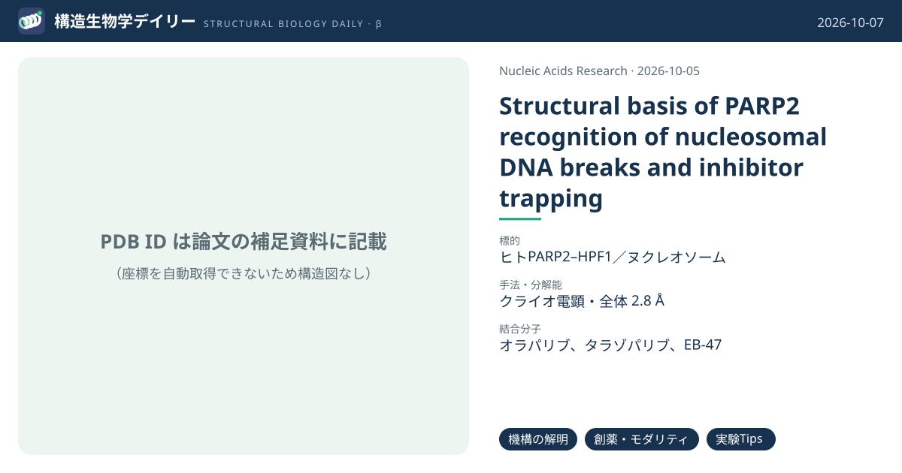
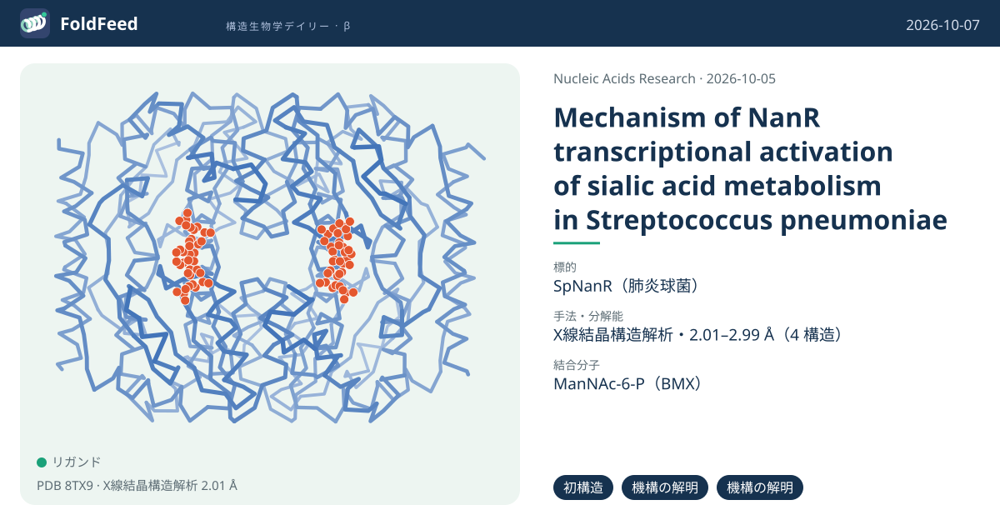
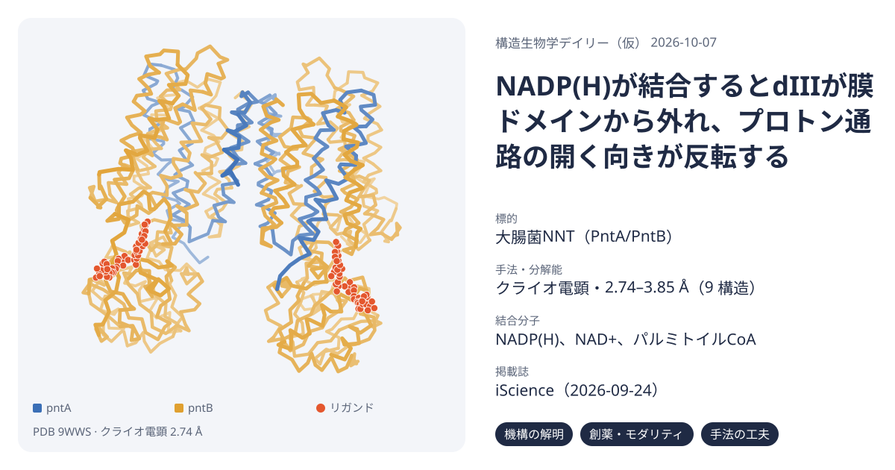

# 構造生物学デイリー（仮） 2026-10-07

Europe PMC に 2026-10-06 に登録されたオープンアクセス論文 25 本のうち、新しい構造を報告した論文は 4 本。そこから 3 本を紹介する。

> この号は AI が論文本文から作成した**レビュー用の下書き**です。数値・ID・リガンドは PDB / UniProt から取得し、AI の記述には本文からの引用を付けています。

## 1. PARP2がヌクレオソーム内のDNA切断を認識する構造と、PARP阻害剤による変化をクライオ電顕で捉えた

**Structural basis of PARP2 recognition of nucleosomal DNA breaks and inhibitor trapping**  
*Nucleic Acids Research*（2026-10-05） · [論文](https://doi.org/10.1093/nar/gkag939) · ライセンス: cc by

### 3行要約

- **背景**：一本鎖切断（SSB）は最も頻繁なDNA損傷だが、クロマチンの制約された形の中でPARP2がそれをどう認識するかは分かっていなかった。
- **やったこと**：SHL +5.3に一本鎖切断を入れたヌクレオソームとPARP2・HPF1の複合体をクライオ電顕で解析（全体2.8 Å）。オラパリブなど阻害剤3種の存在下でも構造を決めた。
- **分かったこと**：WGRドメインが切断部位を、HDとHPF1が反対側のDNAジャイアを掴む多価結合を形成。阻害剤はDNA結合側の界面を安定化する一方、触媒モジュールを動的にし、DNAの非対称なほどけを促した。

### ここが面白い

**［機構の解明］** WGRドメインが上側のDNAジャイアで切断を認識し、HDのArg296とHPF1の塩基性残基が下側のジャイアに接触。ヌクレオソームDNAの2周分をまたぐ結合が、裸のDNA（Kd 653 nM）よりヌクレオソーム上の切断（Kd 約55 nM）を強く好む理由を説明する。

根拠（論文本文）

> The WGR domain recognizes the break on the upper DNA gyre through conserved contacts, while Arg296 on helix αE of the HD and basic residues in HPF1 contact the lower gyre, together spanning both DNA gyres and the inter-gyre space  
> — Results

> free DNA containing the same SSB was bound with substantially lower affinity (Kd = 653 nM)  
> — Results

**［創薬・モダリティ］** オラパリブ・タラゾパリブ・EB-47はいずれもWGRの揺らぎを抑えてWGR–HD界面を安定化し、ART–HPF1触媒モジュールはむしろ動的になった。DNA結合面が固まることが、阻害剤によるPARP2のクロマチン上への「捕捉」の構造的な説明になりうる。阻害剤はDNAの非対称なほどけも促した。

根拠（論文本文）

> Together, these results indicate that the three PARPis tested in this study induce a common structural response characterized by reduced conformational heterogeneity of the WGR domain and stabilization of WGR–HD interactions.  
> — Results

> Thus, inhibitor-associated nucleosome unwrapping is coupled to PARP2–HPF1 binding, rather than arising from a direct, global effect of PARPis on nucleosome structure.  
> — Results

**［実験Tips］** 当初は複合体がグリッド上（空気–水界面）で壊れて見えなかった。ヌクレオソームのacidic patchに結合するscFv（PL2-6抗体由来）で安定化し、凝集しやすいN末端の天然変性領域を除いたPARP2（90–583）を使うことで構造決定に成功した。

根拠（論文本文）

> Despite extensive optimization of sample and vitrification conditions, we were initially unable to detect nucleosome particles with PARP2 and HPF1, suggesting disruption of the complex at the air–water interface.  
> — Results

> we employed the scFv derived from the PL2-6 antibody, which is known to bind the acidic patch and stabilize nucleosomes for cryo-EM  
> — Results

### 構造データ

寄託の記載はあるが、ID は補足資料にのみ記載されている。

### 実験メモ

- **発現系**：PARP2はpET-SUMOでE. coli Rosetta 2 pLysS、20°Cで一晩誘導。HPF1はBL21(DE3)-CodonPlus（RIPL）、16°Cで一晩。
- **コンストラクト**：ヒトPARP2 isoform 1の90–583（最初の89残基を除去）。全長はグリッド上で凝集した。WGRドメインのみ（90–212）も使用。
- **精製**：Ni-NTA → ULP1でHis-SUMOタグ切断 → 逆Ni-NTA → HiTrap Heparin → Superdex 200。
- **結晶化／グリッド作製**：ヌクレオソーム 2 µMにscFv 8 µMを先に加え、PARP2 5 µM・HPF1 8 µM（阻害剤は10 µM）を添加。架橋やゲルろ過はなし。Quantifoil R2/1 Cu、Vitrobot 4°C・湿度100%。
- **データ収集・解析**：Titan Krios G3i（300 kV）＋K3、エネルギーフィルター（スリット20 eV）。CryoSPARC v4.7.0で処理。

根拠（論文本文）

> PARP2 construct (residues 90–583) lacking the first 89 amino acids and PARP2-WGR construct (residues 90–212) were generated by PCR and cloned into the pET-SUMO expression vector using Gibson assembly.  
> — Methods

> First, nucleosomes containing an SSB at SHL +5.3 (2 µM) were incubated with scFv (8 µM) for 15 min at ambient temperature.  
> — Methods

> No chemical crosslinking, gel filtration, or other enrichment or purification steps were performed before vitrification.  
> — Methods

> Cryo-EM data were collected on a Titan Krios G3i transmission electron microscope (Thermo Fisher Scientific) operated at 300 kV  
> — Methods

> 📝 編集者への確認事項：PDB/EMDB の ID は補足資料（Table S5）にのみ記載されており、構造データ表と構造図は空欄。ヒストンはショウジョウバエ由来。

---

## 2. 肺炎球菌の転写因子NanRの全長構造：代謝物が四量体を橋渡しし、アルギニン対がDNAを読む

**Mechanism of NanR transcriptional activation of sialic acid metabolism in Streptococcus pneumoniae**  
*Nucleic Acids Research*（2026-10-05） · [論文](https://doi.org/10.1093/nar/gkag953) · ライセンス: cc by

### 3行要約

- **背景**：肺炎球菌はシアル酸を感知してnan・siaAオペロンを活性化するが、RpiR型転写因子NanRによる活性化の分子機構は分かっていなかった。
- **やったこと**：エフェクター探索（DSF・ITC）、超遠心・native MS・SAXSによる会合状態の解析に加え、apo、エフェクター結合型、DNA複合体のX線結晶構造を決定した。
- **分かったこと**：N-アセチルマンノサミン-6-リン酸（ManNAc-6-P）が二量体–四量体平衡を四量体側へ2000倍以上傾ける一方、DNAへの親和性は変えない。DNA結合ドメインが異性化酵素ドメインと構造的に連動しないためと説明できる。

### ここが面白い

**［初構造］** RpiRファミリー転写因子で、エフェクターなし（apo）とDNA複合体の全長構造は初めて。これまで全長のRpiR構造は2例しかなく、いずれもこの2状態ではなかった。

根拠（論文本文）

> To date, no crystal structures of full-length RpiR bound to DNA or in the apo form (i.e. without effector) have been reported, representing a key knowledge gap in understanding the molecular mechanism of RpiR transcriptional regulators.  
> — Introduction

**［機構の解明］** ManNAc-6-Pは1分子で3つのプロトマーにまたがって結合し（リン酸基はSer135・Ser179・Ser181・Thr184、糖部分はArg148・Tyr229と隣の二量体のAsp160）、界面を組み替えずに四量体を「橋渡し」して安定化する。R148A変異体はエフェクターがあっても二量体のまま。

根拠（論文本文）

> Instead, each N-acetylmannosamine-6-phosphate molecule bridges three monomers across the tetrameric interface, thereby stabilizing the tetrameric state  
> — Results

> In contrast, SpNanRR148A is exclusively dimeric at the same concentration as wild type even in the presence of N-acetylmannosamine-6-phosphate  
> — Results

**［機構の解明］** 各サブユニットのArg67がDNAの副溝に入り込み、2つのグアニジノ基が約3.6 Åの距離でπスタックする珍しい配置をとる。塩基との直接の接触は少なく、TpAステップでの副溝の歪みを読む「間接読み取り」で配列特異性を出していると考えられる。

根拠（論文本文）

> The guanidinium groups π-stack ∼3.6 Å apart (averaged across the two dimers) and each forms a weak hydrogen bond with the N3 nitrogen of adenine at position 10  
> — Results

> These observations suggest that specificity is achieved through recognition of a sequence-dependent distorted B-DNA structure—the “indirect read-out” mechanism—while affinity is primarily driven by interactions between the DNA-binding domain and the phosphate backbone.  
> — Results

### 構造データ

| PDB | 手法 | 分解能 | 公開 | 生物種 | リガンド |
|---|---|---|---|---|---|
| [8V5F](https://www.rcsb.org/structure/8V5F) | X線結晶構造解析 | 2.55 Å | 2024-12-04 | Streptococcus pneumoniae | — |
| [8TX9](https://www.rcsb.org/structure/8TX9) | X線結晶構造解析 | 2.01 Å | 2024-09-11 | Streptococcus pneumoniae | BMX |
| [8V4V](https://www.rcsb.org/structure/8V4V) | X線結晶構造解析 | 2.95 Å | 2024-12-04 | Streptococcus pneumoniae | BMX |
| [9DQN](https://www.rcsb.org/structure/9DQN) | X線結晶構造解析 | 2.99 Å | 2025-08-20 | Streptococcus pneumoniae, synthetic construct | — |

- [A0A064C3N8](https://www.uniprot.org/uniprotkb/A0A064C3N8) ybbH MurR/RpiR family transcriptional regulator — *Streptococcus pneumoniae* （PDB で初めての構造）
- [A0A0H2ZPE9](https://www.uniprot.org/uniprotkb/A0A0H2ZPE9)  Phosphosugar-binding transcriptional regulator, putative — *Streptococcus pneumoniae serotype 2 (strain D39 / NCTC 7466)* （PDB で初めての構造）

### 実験メモ

- **発現系**：pET30ΔSEでE. coli BL21(DE3)。1 mM IPTGで誘導し、25°Cで一晩（14–16時間）。
- **コンストラクト**：全長SpNanR（WP_000360349.1）を親和性タグなしで発現。
- **精製**：硫安沈殿（50%飽和）→ 陰イオン交換 → ヘパリン → Superdex 200 Increase。タグを使わず電荷とDNA結合性で精製。
- **結晶化／グリッド作製**：タンパク質1 µL＋リザーバー1 µLで、結晶は4–16週かけて成長。初期位相は三ヨウ化物ソーキング（1–5分、それ以上は結晶が割れる）によるSAD。
- **データ収集・解析**：Australian Synchrotron MX2（EIGER 16M）。弱い異常分散シグナルを補うため7データセットを統合。

根拠（論文本文）

> The pET30ΔSE-SpNanR and mutated constructs were transformed into Escherichia coli BL21(DE3) competent cells  
> — Methods

> purified without an affinity tag, instead utilizing charge-based (ion exchange) and DNA-binding (heparin) characteristics  
> — Results

> Briefly, 1 μL protein solution was mixed with 1 μL reservoir solution. The drops were incubated for 4–16 weeks before harvest.  
> — Methods

> Protein crystals of SpNanR + N-acetylmannosamine-6-phosphate were added to mother liquor that had been supplemented with triiodide (10 mM) and soaked for 1–5 min; the crystals cracked if soaked longer.  
> — Methods

> To enhance the weak anomalous signal, seven data sets were merged  
> — Methods

> 📝 編集者への確認事項：PDB エントリーは 2024–2025 年に公開済みで、論文の引用情報はまだ PDB に反映されていない（データ可用性の記載から本論文の寄託と判定）。

---

## 3. 大腸菌トランスヒドロゲナーゼ全長の多状態構造：基質結合でdIIIが膜から外れ、プロトン通路が切り替わる

**Structures of multiple states of the nicotinamide nucleotide transhydrogenase from Escherichia coli**  
*iScience*（2026-09-24） · [論文](https://doi.org/10.1016/j.isci.2026.117657) · ライセンス: cc by

### 3行要約

- **背景**：NNTはNADHからNADP+へのヒドリド転移をプロトン輸送と共役させ、大腸菌ではNADPHの約4割を供給する。全長の大腸菌酵素の構造と状態変化は分かっていなかった。
- **やったこと**：αとβサブユニットを逆順に融合した一本鎖変異体も作り、apo、NADP+/NAD+、NADPH/NADP+、NADPH単独、阻害剤パルミトイルCoA存在下の構造をクライオ電顕で解析した。
- **分かったこと**：apoでは2つのdIIIが膜ドメインdIIに下向きに張り付き、通路に栓をする。NADP(H)が結合するとdIIIが外れて向きを変え、通路は細胞質側に開いてペリプラズム側が閉じる。パルミトイルCoAはapoに近い状態で固定する。

### ここが面白い

**［機構の解明］** dIIIの着脱がプロトン通路の開閉と連動する。さらに外れた2つのdIIIは同時には(dI)2と組まず、片方だけが上向きで寄り添う。二量体の左右で交互にヒドリド転移が進むという触媒サイクルのモデルを提示した。

根拠（論文本文）

> Detachment of dIII is associated with rearrangements in the transmembrane helices that form the proton channel, opening toward the cytoplasmic side and closing it on the periplasmic side.  
> — Discussion

> The structures further indicate that two detached dIII domains do not engage (dI)2 simultaneously; only one adopts a (dI)2-associated orientation while the second dIII remains distal.  
> — Discussion

**［創薬・モダリティ］** 阻害剤パルミトイルCoAはdIIIのNADP(H)結合ポケットに入り込み（アデニンのN6がAsp450と水素結合）、dIIIを下向き・膜付着のapo様状態に固定する。生化学で知られていた競合阻害の構造的な根拠になる。

根拠（論文本文）

> The N6 atom of the purine ring in palmitoyl-CoA forms a hydrogen bond with the OD1 atom of Asp450, located near the NADP(H)-binding site of dIII  
> — Results

> Palmitoyl-CoA is buried within the pocket, partially occupying the position normally taken by NADP(H).  
> — Results

**［手法の工夫］** 柔軟で見えにくいdIを捉えるため、βのC末端とαのN末端を原生生物Paratrimastix pyriformis由来のリンカーでつないだ一本鎖変異体を設計。活性は野生型の約1/3を保ち、apoでdIまで含めてモデル化できた。著者はリンカーが動きを制約しうる点も注意している。

根拠（論文本文）

> a single-subunit variant was genetically engineered by fusing the two native subunits, α (PntA) and β (PntB), with a linker joining the C-terminus of β to the N-terminus of α  
> — Results

> its steady-state turnover rate (kcat) was reduced to 14.3 s−1, approximately 3-fold lower than that of WT EcTH (42 s−1; Figure 1D)  
> — Results

> the linker could potentially restrict or bias the movements of dIII relative to dI  
> — Discussion

### 構造データ

| PDB | 手法 | 分解能 | 公開 | 生物種 | リガンド |
|---|---|---|---|---|---|
| [9UUY](https://www.rcsb.org/structure/9UUY) | クライオ電顕 | 3.85 Å | 2026-05-27 | Escherichia coli K-12 | — |
| [9UV7](https://www.rcsb.org/structure/9UV7) | クライオ電顕 | 3.43 Å | 2026-05-27 | Escherichia coli K-12 | — |
| [9UV2](https://www.rcsb.org/structure/9UV2) | クライオ電顕 | 2.83 Å | 2026-05-27 | Escherichia coli K-12 | — |
| [9WWS](https://www.rcsb.org/structure/9WWS) | クライオ電顕 | 2.74 Å | 2026-09-30 | Escherichia coli K-12 | NAP |
| [9WWU](https://www.rcsb.org/structure/9WWU) | クライオ電顕 | 3.42 Å | 2026-09-30 | Escherichia coli K-12 | NAP |
| [9WWV](https://www.rcsb.org/structure/9WWV) | クライオ電顕 | 3.38 Å | 2026-09-30 | Escherichia coli K-12 | NAD |
| [9UV3](https://www.rcsb.org/structure/9UV3) | クライオ電顕 | 2.88 Å | 2026-05-27 | Escherichia coli K-12 | COA |
| [9UVB](https://www.rcsb.org/structure/9UVB) | クライオ電顕 | 3.23 Å | 2026-05-27 | Escherichia coli K-12 | — |
| [9WWW](https://www.rcsb.org/structure/9WWW) | クライオ電顕 | 3.81 Å | 2026-09-30 | Escherichia coli K-12 | NDP |

- [P07001](https://www.uniprot.org/uniprotkb/P07001) pntA NAD(P) transhydrogenase subunit alpha — *Escherichia coli (strain K12)* （既存の PDB 構造 6 件）
- [P0AB67](https://www.uniprot.org/uniprotkb/P0AB67) pntB NAD(P) transhydrogenase subunit beta — *Escherichia coli (strain K12)* （既存の PDB 構造 3 件）

### 実験メモ

- **発現系**：pntAB欠損株 C43(DE3) Δcyo ΔpntAB（THO株）にpET16b-EcTHを導入して発現。
- **コンストラクト**：N末端Hisタグ付き。野生型と、β–リンカー–αの一本鎖融合体（102 kDa）。
- **精製**：LMNGで可溶化し、IMAC → サイズ排除クロマトグラフィー。
- **結晶化／グリッド作製**：Quantifoil R 2/1 金グリッド（300メッシュ）、Vitrobot Mark IV 8°C・湿度100%、ブロット2.5–4秒。阻害剤は1 mMで事前に添加。
- **データ収集・解析**：Titan Krios＋Gatan K3（カウンティングモード）。

根拠（論文本文）

> The pntAB knockout strain (THO, C43(DE3) Δcyo ΔpntAB), in which the pnt genes were replaced by a chloramphenicol resistance gene, was transformed with the pET16b-EcTH plasmid  
> — Methods

> Recombinant proteins with N-terminal His-tags were purified in LMNG detergent using immobilized metal-affinity chromatography followed by size-exclusion chromatography.  
> — Results

> For each sample, 3 μl was applied to a freshly glow-discharged 300-mesh Quantifoil R 2/1 gold grid and blotted for 2.5–4 s with a blotting force of −4 at 8°C and 100% humidity in a FEI Vitrobot Mark IV (Thermo Fisher).  
> — Methods

> the single-subunit EcTH was incubated with 1 mM palmitoyl-CoA prior to cryo-EM grid preparation  
> — Results

> 📝 編集者への確認事項：大腸菌の dI2 と dI2–dIII の構造は既報で、本論文の新規性は全長酵素の状態変化。UniProt 上は既存の PDB 構造がある（初構造ではない）。

---

## その他の新着

- [Size and sequence variation of the Lid of the Cas12a nuclease domain results in a nickase phenotype](https://doi.org/10.1093/nar/gkag934) — *Nucleic Acids Res*（新しい構造：9WNE）
