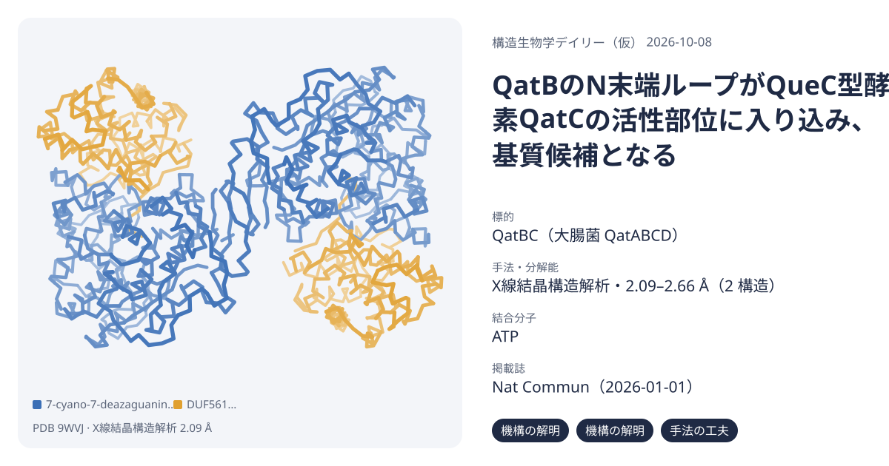
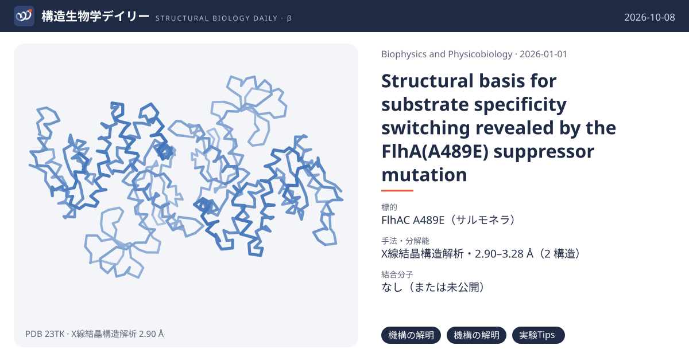
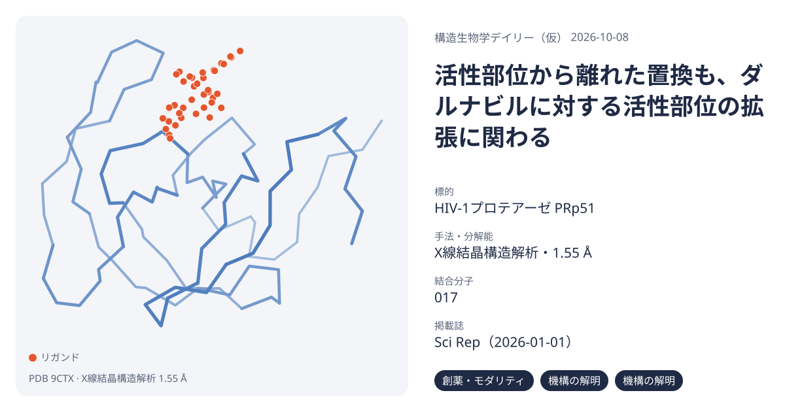
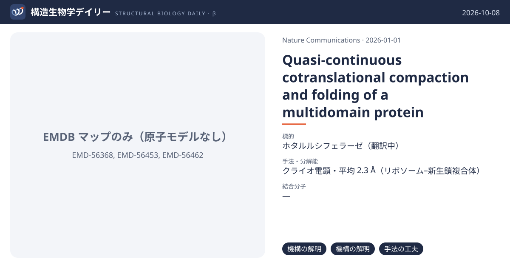

# 2026-10-08 号

**今日の新しい構造：4 本**　Europe PMC に 2026-10-07 に登録されたオープンアクセス論文 33 本のうち、新しい構造を報告した論文は 4 本。すべて紹介する。

| # | 標的 | 手法・分解能 | 見出し |
|---|---|---|---|
| 1 | QatBC（大腸菌 QatABCD） | X線結晶構造解析・2.09–2.66 Å（2 構造） | 抗ファージ防御系QatBCの結晶構造：QatBのN末端がQatC活性部位に挿入され、防御に必須だった `機構の解明` `機構の解明` `手法の工夫` |
| 2 | FlhAC A489E（サルモネラ） | X線結晶構造解析・2.90–3.28 Å（2 構造） | FlhA(A489E)抑制変異体の結晶構造：Arg-386周辺の塩橋網の組み換えが鞭毛輸送装置の基質切り替えを助ける `機構の解明` `機構の解明` `実験Tips` |
| 3 | HIV-1プロテアーゼ PRp51 | X線結晶構造解析・1.55 Å | ダルナビル耐性HIVプロテアーゼ（14置換）の複合体構造：離れた置換も活性部位の拡張に寄与する `創薬・モダリティ` `機構の解明` `機構の解明` |
| 4 | ホタルルシフェラーゼ（翻訳中） | クライオ電顕・平均 2.3 Å（リボソーム–新生鎖複合体） | ホタルルシフェラーゼの共翻訳フォールディングを力プロファイル解析とクライオ電顕で追跡 `機構の解明` `機構の解明` `手法の工夫` |

> この号は AI が論文本文から作成した**レビュー用の下書き**です。数値・ID・リガンドは PDB / UniProt から取得し、AI の記述には本文からの引用を付けています。

---

## 1｜QatBC（大腸菌 QatABCD）

### 抗ファージ防御系QatBCの結晶構造：QatBのN末端がQatC活性部位に挿入され、防御に必須だった

*Nature Communications*（2026-01-01） · [論文](https://doi.org/10.1038/s41467-026-77369-4) · ライセンス: cc by-nc-nd  
原題：Structural and functional insights into QueC-family protein in QatABCD anti-phage system

#### 3行要約

- **背景**：QatABCDは広く分布する抗ファージ防御系で、QueC型タンパク質QatCが特徴的な構成要素だが、作用機構もQatCの機能も不明だった。
- **やったこと**：QatBCD複合体を共発現で調製し、QatBC複合体のapo型とATP結合型を結晶構造解析した。変異体はファージプラークアッセイで防御能を評価した。
- **分かったこと**：QatBのN末端ループがQatCの活性部位に挿入される。活性中心、亜鉛結合部位、QatB N末端、QatB-QatC界面の変異はいずれも防御能を下げた。QatDは柔軟に結合する。

#### ここが面白い

**［機構の解明］** QatBのN末端ループがQatCの推定活性部位に挿入され、CBASSのCap9–CdnDと同様の配置をとる。QatBがQatCの基質である可能性を示唆し、ペプチド解析ではQatB N末端のNDG修飾も検出された（修飾効率は低いとみられる）。

根拠（論文本文）

> The most notable feature of the interaction is that the QatB N-terminal loop is inserted into the putative active site of QatC  
> — Results

> identified an NDG-modified N-terminal peptide (GTSKAY) from QatB  
> — Results

**［機構の解明］** ATP結合型（2.66 Å）ではF235がアデニンとπ–πスタッキングし、SXGXDSモチーフがβ・γリン酸を配位する。CDGの密度はなく、ATPピロホスファターゼ活性も検出できず、QatCの本来の基質は未解明のままだ。

根拠（論文本文）

> QatC F235 displays a marked conformational change compared with its apo state, to form π-π stacking with the adenine base of the ATP molecule.  
> — Results

> EcQatC does not exhibit obvious ATP pyrophosphatase activity either in the presence or absence of CDG  
> — Results

**［手法の工夫］** QatBのN末端を天然のまま得るため、Gly2のコドンをUlp1切断部位に直結した。N末端へのHisタグ付加は防御活性を著しく下げることが分かっており、この工夫が必要な理由になる。

根拠（論文本文）

> we directly linked the codon corresponding to the second glycine residue of QatB to the codon corresponding to the cleavage site of Ulp1  
> — Methods

> adding an N-terminal His-tag before QatB M1 all severely decreased the anti-phage activity of the Qat system  
> — Results

#### 構造データ

| PDB | 手法 | 分解能 | 公開 | 生物種 | リガンド |
|---|---|---|---|---|---|
| [9WVJ](https://www.rcsb.org/structure/9WVJ) | X線結晶構造解析 | 2.09 Å | 2026-09-16 | Escherichia coli | — |
| [9X6C](https://www.rcsb.org/structure/9X6C) | X線結晶構造解析 | 2.66 Å | 2026-09-16 | Escherichia coli | ATP |

- [A0A4Q0WMG2](https://www.uniprot.org/uniprotkb/A0A4Q0WMG2)  Uncharacterized protein — *Escherichia coli* （既存の PDB 構造 2 件）
- [A0A6N2XJ30](https://www.uniprot.org/uniprotkb/A0A6N2XJ30)  Uncharacterized protein — *Citrobacter amalonaticus* （既存の PDB 構造 1 件）

#### 実験メモ

- **発現系**：大腸菌BL21(DE3)。OD600 0.8で0.2 mM IPTG、18 ℃で12時間誘導
- **コンストラクト**：N末端His6-SUMO融合（Ulp1切断）。QatBはGly2から始まる天然のN末端を再現
- **精製**：Ni-NTAでUlp1切断後、Superdex 200 increase 10/300 GLでゲルろ過
- **結晶化／グリッド作製**：15 mg/mL、シッティングドロップ蒸気拡散、18 ℃。ATP型は1 mM ATP・1 mM CDG・2 mM MgCl2を氷上1時間プレインキュベート
- **データ収集・解析**：SSRF BL02U1、0.979 Å、EIGER2 X 9M。AlphaFold2予測モデルで分子置換、PHENIXで精密化

根拠（論文本文）

> The cells were grown at 37 °C until OD600 nm reached 0.8 and then induced at 18 °C for 12 h.  
> — Methods

> Both crystal forms of protein complexes were obtained using the sitting-drop vapor diffusion method at 18 °C by mixing 0.8 μL of protein solution with 0.8 μL of reservoir solution.  
> — Methods

> All diffraction data were collected at the SSRF beamlines BL02U1 using a wavelength of 0.979 Å and a DECTRIS EIGER2 X 9M detector.  
> — Methods

> The initial model was solved by molecular replacement with a structure predicted by AlphaFold2  
> — Methods

> 📝 編集者への確認事項：本文によれば同時期に別グループもQatBC構造を報告している（本文の引用31, 32）。初構造とは書いていない。QatCの触媒反応は未再構成で、N末端修飾はペプチドレベルのMSのみ。

---

## 2｜FlhAC A489E（サルモネラ）

### FlhA(A489E)抑制変異体の結晶構造：Arg-386周辺の塩橋網の組み換えが鞭毛輸送装置の基質切り替えを助ける

*Biophysics and Physicobiology*（2026-01-01） · [論文](https://doi.org/10.2142/biophysico.bppb-v23.0030) · ライセンス: cc by-nc-sa  
原題：Structural basis for substrate specificity switching revealed by the FlhA(A489E) suppressor mutation

#### 3行要約

- **背景**：鞭毛のIII型分泌装置はフック完成時に基質特異性を切り替える。FlhB(P270A)の切り替え不全を部分的に回復するFlhA(A489E)の機構は不明だった。
- **やったこと**：FlhAC(A489E)の結晶構造を半閉型（2.90 Å）と開型（3.28 Å）の2状態で決定し、AlphaFold3によるFlhAC–FlhB複合体予測と運動性・分泌アッセイを組み合わせた。
- **分かったこと**：A489EはArg-386・Glu-483周辺の塩橋網を組み換え、α2ヘリックス周辺の配置を変える。FlhBのC末端尾部がα2–β2の溝を占めるという予測モデルと合わせ、状態遷移の障壁を下げると考えられる。

#### ここが面白い

**［機構の解明］** 野生型ではArg-386がGlu-483と塩橋を作る。A489Eの半閉型ではArg-386がGlu-489側に引かれてGlu-483から離れ、開型ではGlu-489とGlu-483の両方と塩橋を作る。野生型にない静電ネットワークが現れた。

根拠（論文本文）

> Thus, the introduced Glu-489 establishes a new electrostatic interaction with Arg-386, altering the orientation of the Arg-386 side chain and disrupting its original interaction with Glu-483.  
> — Results

> These interactions generate an alternative electrostatic network that is not observed in the wild-type structure  
> — Results

**［機構の解明］** AlphaFold3の5モデルすべてで、FlhBのC末端尾部がFlhA D1ドメインのα2–β2の溝に置かれた。この溝はフィラメント型リングでの隣接サブユニットのリンカー結合部位と重なる。ただし結合は予測であり、実験では示していない。

根拠（論文本文）

> all five independently generated models consistently positioned FlhBCCT at a groove formed between the α2 helix and β2 strand of the D1 domain of FlhAC  
> — Results

> the α2–β2 groove overlaps with the binding site for the flexible linker region of FlhAC  
> — Results

**［実験Tips］** Arg-386をAlaに置換した変異体は、FliH・FliIがあれば運動性と分泌が正常だが、FliH・FliIを欠くと両方が阻害された。ATPase複合体が働かない条件でこの塩橋網が重要になることを示唆する。

根拠（論文本文）

> the flhA(R386A) substitution inhibited both motility (Figure 5A, middle panel) and protein export (Figure 5B, middle panel) in the absence of FliH and FliI.  
> — Results

#### 構造データ

| PDB | 手法 | 分解能 | 公開 | 生物種 | リガンド |
|---|---|---|---|---|---|
| [23TM](https://www.rcsb.org/structure/23TM) | X線結晶構造解析 | 3.28 Å | 2026-10-07 | Salmonella enterica subsp. enterica serovar Typhimurium | — |
| [23TK](https://www.rcsb.org/structure/23TK) | X線結晶構造解析 | 2.90 Å | 2026-10-07 | Salmonella enterica subsp. enterica serovar Typhimurium | — |

- [P40729](https://www.uniprot.org/uniprotkb/P40729) flhA Flagellar biosynthesis protein FlhA — *Salmonella typhimurium (strain LT2 / SGSC1412 / ATCC 700720)* （既存の PDB 構造 12 件）

#### 実験メモ

- **発現系**：大腸菌BL21(DE3)、LB培地、30 ℃で一晩培養
- **コンストラクト**：N末端His-tag付きFlhAC(A489E)（pYI104-SP3）
- **精製**：HisTrap HP 5 mL、続いてSuperdex 75 10/300 GL。10 mg/mLに濃縮
- **結晶化／グリッド作製**：シッティングドロップ蒸気拡散。形態1はPEG 3000・リン酸pH 6.2・グリセロール、形態2はPEG 3000・HEPES pH 7.5・NaCl、いずれも20 ℃
- **データ収集・解析**：SPring-8 BL41XU・BL45XU。MOSFLM・AIMLESSで処理し、6AI0と3A5Iを鋳型に分子置換

根拠（論文本文）

> His-FlhAC(A489E) was purified by affinity chromatography using a HisTrap HP 5 mL column (Cytiva), followed by size-exclusion chromatography on a Superdex 75 10/300 GL column (Cytiva)  
> — Materials and methods

> Form 1 crystals were grown at 20°C using a reservoir solution containing 0.1 M K2HPO4/Na2HPO4 (pH 6.2), 10% (w/v) polyethylene glycol 3000, and 10% (w/v) glycerol.  
> — Materials and methods

> X-ray diffraction data were collected at beamlines BL41XU and BL45XU at SPring-8  
> — Materials and methods

> Initial phases for Form 1 and Form 2 crystals were obtained by molecular replacement using Phaser-MR [20] in Phenix [21] with PDB entries 6AI0 and 3A5I, respectively.  
> — Materials and methods

> 📝 編集者への確認事項：FlhBとの相互作用はAlphaFold3予測のみで、実験的には未検証。本文の記載どおり「予測」「考えられる」で書いた。

---

## 3｜HIV-1プロテアーゼ PRp51

### ダルナビル耐性HIVプロテアーゼ（14置換）の複合体構造：離れた置換も活性部位の拡張に寄与する

*Scientific Reports*（2026-01-01） · [論文](https://doi.org/10.1038/s41598-026-64620-7) · ライセンス: cc by  
原題：Distal amino-acid substitutions contribute to HIV protease inhibitor resistance as directly as proximal amino-acid substitutions

#### 3行要約

- **背景**：耐性置換は活性部位近傍の主要置換と離れた副次置換に分けられるが、離れた置換が阻害剤結合にどう効くかは不明確だった。
- **やったこと**：ダルナビル耐性株由来の14置換プロテアーゼ（PRp51）とダルナビルの複合体を1.55 Åで結晶構造解析し、GRL142との比較を1500 nsの分子動力学（MD）計算で行った。
- **分かったこと**：結晶構造では相互作用に大きな差はなかった。MDではダルナビル複合体でフラップが開く集団と活性部位の拡張が大きく、GRL142では小さかった。主要・副次の二分類は単純すぎる可能性がある。

#### ここが面白い

**［創薬・モダリティ］** PRp51はダルナビルに対しKiで大きく低下するが、GRL142では低下が小さい。抗ウイルス活性（EC50）の低下はダルナビルが353倍、GRL142が88倍だった。構造に基づく設計で耐性変異に強い阻害剤を作れる余地を示す。

根拠（論文本文）

> In summary, DRV had significant reductions in enzymatic and antiviral activities against PRp51 and HIVp51, respectively.  
> — Results

> GRL142 maintained good potency and had much smaller fold reductions in its Ki and EC50 values  
> — Results

**［機構の解明］** 結晶構造だけでは耐性を説明できなかった。14置換のうち活性部位に直接接するのは主にVal82とIle84で、残り11個は直接結合しない。MDで初めて、フラップの開閉と活性部位容積の差として違いが現れた。

根拠（論文本文）

> in their respective crystal structures, there were no noteworthy differences in polar and van der Waals interactions of DRV-PRwt over DRV-PRp51.  
> — Results

> The other eleven residues that underwent substitutions did not have a direct binding interaction with DRV.  
> — Results

**［機構の解明］** MDでは、活性部位容積が結晶構造の値から100 Å3以内に収まる集団がダルナビル–PRwtで61%、ダルナビル–PRp51で29%だった。GRL142では84%と61%。著者は離れた置換が拡張に寄与すると解釈している。

根拠（論文本文）

> only 29% of the DRV-PRp51 population has an active site volume within 100 Å3 of the DRV- PRwt active site volume  
> — Results

> The results suggest that the minor substitutions have a more direct impact on the loss of binding of DRV and in causing HIV’s drug resistance against DRV.  
> — Discussion

#### 構造データ

| PDB | 手法 | 分解能 | 公開 | 生物種 | リガンド |
|---|---|---|---|---|---|
| [9CTX](https://www.rcsb.org/structure/9CTX) | X線結晶構造解析 | 1.55 Å | 2024-08-07 | Human immunodeficiency virus 1 | 017 |

- [O38893](https://www.uniprot.org/uniprotkb/O38893) pol HIV-1 retropepsin — *Human immunodeficiency virus type 1* （既存の PDB 構造 1 件）

#### 実験メモ

- **発現系**：大腸菌Rosetta (DE3) pLysS、ZYM-5052系の自己誘導培地、37 ℃で20〜22時間。封入体として回収
- **精製**：封入体を尿素で洗浄後、ギ酸で変性。逆相クロマトグラフィー（RESOURCE RPC）後に脱塩し、中和バッファーでリフォールド
- **結晶化／グリッド作製**：ハンギングドロップ蒸気拡散。ダルナビル複合体は0.15 M 硫酸アンモニウム、0.1 M HEPES pH 7.0、20% PEG 4000。30%グリセロールで凍結保護
- **データ収集・解析**：ダルナビル複合体はSPring-8 BL44XU（0.9 Å）。既報の別のプロテアーゼ構造を探索モデルに分子置換、Refmacで精密化

根拠（論文本文）

> Rosetta (DE3) pLysS strain (Novagen) was transformed with PRDRVRp51 expression vector  
> — Materials and methods

> The unfolded PRDRVRp51 was refolded with the addition of a neutralizing buffer A  
> — Crystallization of Darunavir-PRp51 and GRL142-PRp51 complexes

> PRDRVRp51-DRV complexes were formed in 0.15 M (NH4)2SO4, 0.1 M HEPES pH 7.0, 20% (w/v) PEG 4000.  
> — Crystallization of Darunavir-PRp51 and GRL142-PRp51 complexes

> were collected under cryogenic temperatures at SPring-8 BL44XU using X-rays of 0.9 Å wavelength  
> — Materials and methods

> the structure 6OGL was used as the search model for molecular replacement using Molrep  
> — Materials and methods

> 📝 編集者への確認事項：GRL142複合体(6MKL)も本論文の構造だが、今回の候補一覧にはダルナビル複合体9CTXのみが載る。結論の多くは著者のMD解析に基づく。本文中でKi倍率が1,432倍（本文）と1,438（表）で食い違うため数値は引用していない。

---

## 4｜ホタルルシフェラーゼ（翻訳中）

### ホタルルシフェラーゼの共翻訳フォールディングを力プロファイル解析とクライオ電顕で追跡

*Nature Communications*（2026-01-01） · [論文](https://doi.org/10.1038/s41467-026-78090-y) · ライセンス: cc by  
原題：Quasi-continuous cotranslational compaction and folding of a multidomain protein

#### 3行要約

- **背景**：多くのタンパク質はリボソームから出てくる途中で折りたたみ始める（共翻訳フォールディング）。研究は小さな単一ドメインに偏っており、複数ドメインの大きなタンパク質で過程を細かく追った例は少なかった。
- **やったこと**：550残基のホタルルシフェラーゼを対象に、翻訳停止配列を使う力プロファイル解析（5残基刻み）、停止させたリボソーム–新生鎖複合体（RNC）のクライオ電顕、粗視化モデルとMD、Trigger Factor添加実験を組み合わせた。
- **分かったこと**：折りたたみは少数の協同的な転移の連続ではなく、中程度の力を生む圧縮・折りたたみが準連続的に続く過程だった。RF-2ドメインの折りたたみが大きな力のピークを作り、Trigger Factorはその中央部とC末端ドメインの合成時に新生鎖と広く相互作用する。

#### ここが面白い

**［機構の解明］** 共翻訳フォールディングは、はっきりした少数の折りたたみ転移の連続ではなく、準連続的な圧縮・折りたたみの連なりだった。RF-2ドメインの折りたたみが突出した大きな力のイベントを生み、低い力の数か所は別々の折りたたみ中間体の形成を示すと考えられる。

根拠（論文本文）

> The folding process is characterized by a quasi-continuous series of compaction/folding steps that generate intermediate-size pulling forces on the nascent chain, punctuated by a prominent high-force event that represents the folding of the RF-2 domain  
> — Abstract

> Our analysis uncovers a cotranslational compaction/folding process that is rich in detail and not just a simple succession of a few distinct, cooperative folding transitions.  
> — Abstract

**［機構の解明］** 力プロファイルの初期ピークに対応する3つの新生鎖（N=110, 130, 190残基）をクライオ電顕（平均2.3 Å）で見ると、出口トンネル内に大きな折りたたみドメインは見えなかった。初期のピークはトンネル内での安定な部分構造の形成ではなく、リボソームの外での新生鎖の圧縮を表す。

根拠（論文本文）

> structures were determined at an average resolution of 2.3 Å. For all three constructs, stalled NCs were readily apparent in the ET but with only small compact densities evident near the uL24 loop in the exit port  
> — Results

> The absence of more extensive folded domains in the ET shows that these early FP peaks are not generated by the formation of stable substructures within the ET, but rather represent compaction of the NC outside the ribosome.  
> — Results

**［手法の工夫］** シャペロンTrigger Factorは、RF-2ドメインの中央部とC末端ドメインの初期が合成されるタイミングで新生鎖と広く相互作用する。折りたたみのどの段階でシャペロンが働くかを、力プロファイルの変化として残基解像度で捉えている。

根拠（論文本文）

> Trigger Factor interacts extensively with the nascent chain when the central part of RF-2 and the early parts of the CTD are synthesized.  
> — Abstract

#### 構造データ

原子モデルのない cryo-EM マップ（EMDB）：[EMD-56368](https://www.ebi.ac.uk/emdb/EMD-56368), [EMD-56453](https://www.ebi.ac.uk/emdb/EMD-56453), [EMD-56462](https://www.ebi.ac.uk/emdb/EMD-56462)

#### 実験メモ

- **発現系**：クライオ電顕用はN末端に6xHisタグを付けたFLucをpET19bから、E. coli BL21(DE3)で1 mM IPTG誘導。SecM(3W)の強い翻訳停止配列で新生鎖を停止させた。
- **コンストラクト**：N=110, 130, 190残基の3つの停止コンストラクト。
- **精製**：停止させたリボソーム–新生鎖複合体（RNC）を精製。
- **結晶化／グリッド作製**：Vitrobotでプランジ凍結（ブロット3秒・待機15秒、湿度100%、4°C）。
- **データ収集・解析**：Krios G3i（300 kV）＋Gatan K3、ピクセルサイズ0.825 Å、総線量40 e–/Ų。CryoSPARC 4.3.0で処理（P-site tRNAを持つ粒子を選別）。

根拠（論文本文）

> a 6xHis tag was added to the N-terminus of FLuc to facilitate purification of RNCs  
> — Methods

> expression from pET19b was induced with 1 mM IPTG in E.coli BL21(DE3)  
> — Methods

> Data were collected on a Krios G3i microscope (Thermo Fisher Scientific, Waltham, Massachusetts, USA) equipped with a Gatan K3 DED at 300 kV with a pixel size of 0.825 Å/pixel, over 40 frames with a total dose of 40 e–/Å2  
> — Methods

> 📝 編集者への確認事項：原子モデルのない cryo-EM マップのみ（EMD-56368 ほか）で、PDB 構造はない。主結果は力プロファイル解析とMDで、クライオ電顕は補強。Europe PMC 上の公開日が 2026-01-01 と表示されるが、索引日は 2026-10-07。構造図は出せないため EMDB マップのみの表示になる。

---
