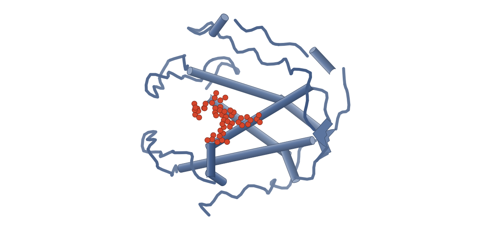
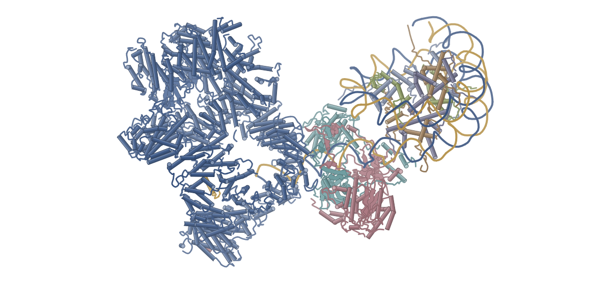
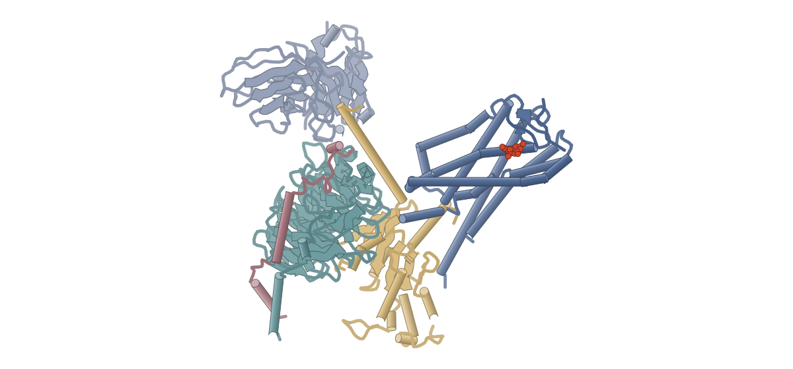
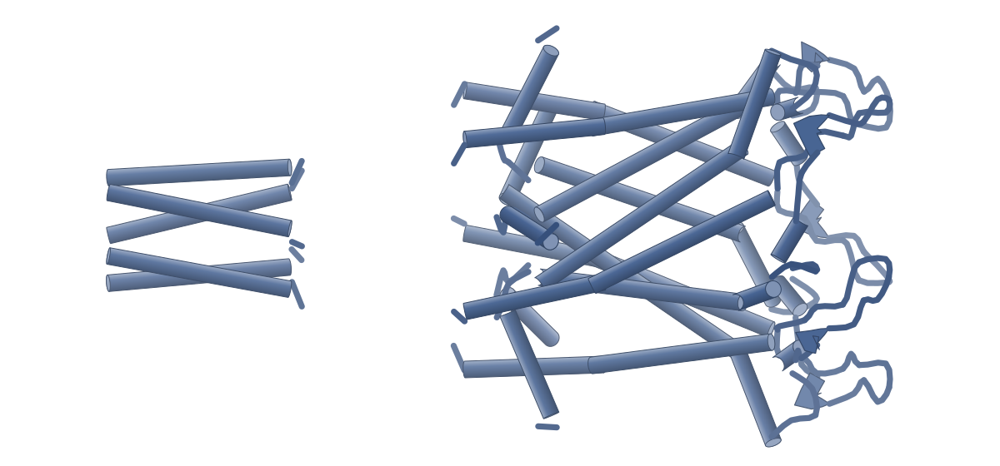
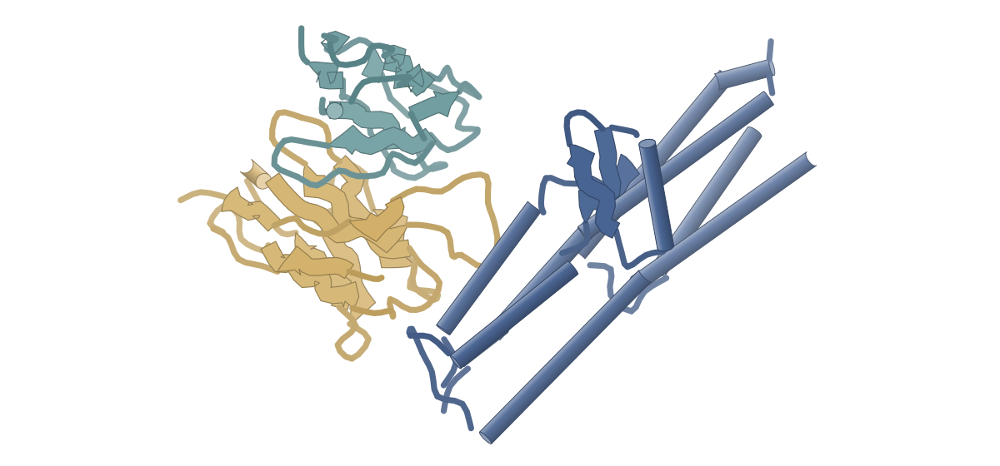

# 2026-10-09 号

**今日の新しい構造：5 本**　Europe PMC に 2026-10-08 に登録されたオープンアクセス論文 21 本のうち、新しい構造を報告した論文は 5 本。すべて紹介する。

| # | 標的 | 手法・分解能 | 見出し |
|---|---|---|---|
| 1 | RyR1（ウサギ骨格筋） | クライオ電顕・2.14–3.18 Å（16 構造） | RyR1のRY12ドメインにダントロレンがATP/ADPと積み重なって結合する：ADPセンサーの可能性 |
| 2 | DNA-PK–ヌクレオソーム複合体 | クライオ電顕・3.80–4.11 Å（5 構造） | ヌクレオソーム末端に結合するKu・DNA-PKの段階的な構造：DNA-PKcsがKuを内側へ押し、DNAを巻き戻す |
| 3 | GPR84–Gi（ヒト） | クライオ電顕・3.03 Å | GPR84–Gi複合体：リガンドのCF3基がLeu336とPhe187を押し、β-アレスチン動員を抑える |
| 4 | 大腸菌MscL（WT・G22S） | クライオ電顕・3.46–3.68 Å（2 構造） | 大腸菌MscLをナノディスクで初めて高分解能に解析：WTもG22Sも閉状態、違いはNMRで見える動態 |
| 5 | 赤痢菌IpaD–抗体Fab | クライオ電顕・3.30–3.40 Å（2 構造） | 赤痢菌IpaDと抗体の複合体構造：溶血を抑える抗体と高める抗体はエピトープが違う |

> この号は AI が論文本文から作成した**レビュー用の下書き**です。数値・ID・リガンドは PDB / UniProt から取得し、AI の記述には本文からの引用を付けています。

---

## 1｜RyR1（ウサギ骨格筋）

### Structural identification of the RY12 domain of RyR1 as an ADP sensor and the target of the malignant hyperthermia therapeutic dantrolene

*Nature Communications*（2026-01-01） · [論文](https://doi.org/10.1038/s41467-026-76519-y) · ライセンス: cc by-nc-nd

**RyR1のRY12ドメインにダントロレンがATP/ADPと積み重なって結合する：ADPセンサーの可能性**

- **背景**：悪性高熱症の唯一の治療薬ダントロレンと誘発物質4CmCについて、RyR1上の結合部位と作用機構は不明だった。
- **やったこと**：RyR1–calstabin2–CaM複合体を、ダントロレン、ATP/ADP、4CmCなどの条件で解析した。RY12の局所精密化で2.4〜2.8 Åを得て、単一チャネル記録で検証した。
- **分かったこと**：ダントロレンはRY12の裂け目でATPまたはADPと積み重なって結合する。ダントロレンがなくてもADP 2分子が結合する。4CmCは4か所に結合した。

#### 読みどころ

ダントロレンはRY12ドメインのクランプ内で、W996がヒダントイン部分、W882がヌクレオチドのアデニンと積み重なる三元複合体として結合する。ヌクレオチドがないとダントロレンの結合もRY12の閉じも見えなかった。

根拠（論文本文）

> Dantrolene was observed binding with either ADP (Fig. 1) or ATP (Supplementary Fig. 1) in a stacking manner between the two α-helices in the RY12 clamp.  
> — Results

> in which we can see no evidence of dantrolene binding or RY12 closure (Supplementary Fig. 3)  
> — Results

ATP:ADP比が6:1の条件でも、RY12にはMg2+で架橋された2分子のADPが結合し、ATPは見えなかった。著者はRY12がATP:ADP比のセンサーとして働く可能性を挙げる。機能の実証は今後の課題とされている。

根拠（論文本文）

> Notably, no bound ATP was evident at the peripheral site, despite a 6:1 ATP-to-ADP ratio in the sample, while ATP was bound at the central site at the CTD-S6 boundary.  
> — Results

> This raises the intriguing possibility that the RY12 domain functions as a sensor for the ATP:ADP ratio in muscle  
> — Results

MH誘発物質4CmCはコアソレノイド中心の隠れたポケットでQ4020と直接相互作用する。溶媒から入る経路がなく、リガンド結合にはドメインの構造変化が必要と考えられる。補助的な結合部位も3つ見つかった。

根拠（論文本文）

> The primary 4CmC molecule, bound to Q4020, is buried in a cryptic pocket without a direct access pathway from the solvent, implying that a conformational change in the CSol domain is required for ligand binding.  
> — Results

#### 構造データ

| PDB | 手法 | 分解能 | 公開 | 生物種 | リガンド |
|---|---|---|---|---|---|
| [9ZND](https://www.rcsb.org/structure/9ZND) | クライオ電顕 | 3.09 Å | 2026-09-16 | Homo sapiens, Oryctolagus cuniculus | U1C, 43M, ATP, CFF, CPS |
| [9ZLF](https://www.rcsb.org/structure/9ZLF) | クライオ電顕 | 2.71 Å | 2026-09-16 | Oryctolagus cuniculus | U1C, ATP |
| [9ZN6](https://www.rcsb.org/structure/9ZN6) | クライオ電顕 | 2.58 Å | 2026-09-16 | Homo sapiens, Oryctolagus cuniculus | ADP, U1C, 43M, CFF |
| [9ZLH](https://www.rcsb.org/structure/9ZLH) | クライオ電顕 | 2.14 Å | 2026-09-16 | Oryctolagus cuniculus | ADP, U1C |
| [9ZN7](https://www.rcsb.org/structure/9ZN7) | クライオ電顕 | 2.23 Å | 2026-09-16 | Homo sapiens, Oryctolagus cuniculus | ADP, ATP |
| [9ZKD](https://www.rcsb.org/structure/9ZKD) | クライオ電顕 | 2.32 Å | 2026-09-16 | Oryctolagus cuniculus | ADP |
| [9ZN8](https://www.rcsb.org/structure/9ZN8) | クライオ電顕 | 2.57 Å | 2026-09-16 | Homo sapiens, Oryctolagus cuniculus | ATP |
| [9ZKC](https://www.rcsb.org/structure/9ZKC) | クライオ電顕 | 2.66 Å | 2026-09-16 | Oryctolagus cuniculus | — |
| [9ZK8](https://www.rcsb.org/structure/9ZK8) | クライオ電顕 | 3.18 Å | 2026-09-16 | Oryctolagus cuniculus | ADP |
| [9ZN9](https://www.rcsb.org/structure/9ZN9) | クライオ電顕 | 2.77 Å | 2026-09-16 | Homo sapiens, Oryctolagus cuniculus | 43M, CFF, ATP |
| [9ZL7](https://www.rcsb.org/structure/9ZL7) | クライオ電顕 | 2.77 Å | 2026-09-16 | Oryctolagus cuniculus | 43M, ATP |
| [9ZNA](https://www.rcsb.org/structure/9ZNA) | クライオ電顕 | 2.37 Å | 2026-09-16 | Homo sapiens, Oryctolagus cuniculus | 43M, ADP, PLC, CFF |
| [9ZLC](https://www.rcsb.org/structure/9ZLC) | クライオ電顕 | 2.52 Å | 2026-09-16 | Oryctolagus cuniculus | ADP |
| [9ZK9](https://www.rcsb.org/structure/9ZK9) | クライオ電顕 | 3.09 Å | 2026-09-16 | Oryctolagus cuniculus | — |
| [9ZKA](https://www.rcsb.org/structure/9ZKA) | クライオ電顕 | 2.64 Å | 2026-09-16 | Oryctolagus cuniculus | — |
| [9ZKE](https://www.rcsb.org/structure/9ZKE) | クライオ電顕 | 2.96 Å | 2026-09-16 | Oryctolagus cuniculus | ATP, KVR |

- [P0DP23](https://www.uniprot.org/uniprotkb/P0DP23) CALM1 Calmodulin-1 — *Homo sapiens* （既存の PDB 構造 335 件）
- [P11716](https://www.uniprot.org/uniprotkb/P11716) RYR1 Ryanodine receptor 1 — *Oryctolagus cuniculus* （既存の PDB 構造 145 件）
- [P68106](https://www.uniprot.org/uniprotkb/P68106) FKBP1B Peptidyl-prolyl cis-trans isomerase FKBP1B — *Homo sapiens* （既存の PDB 構造 119 件）

#### 実験メモ

- **発現系**：ウサギ骨格筋から精製。W882A変異体はHEK293T細胞で発現。
- **コンストラクト**：RyR1に過剰量のCaMとcalstabin2（Cs2）を加え、RyR1–Cs2–CaM複合体を形成。
- **精製**：CHAPS可溶化、HiTrap Q陰イオン交換、TSKgel G4SWXLのサイズ排除クロマトグラフィー。
- **結晶化／グリッド作製**：UltrAuFoil R0.6/1 金グリッド、リガンドを加えた試料3 µL、Vitrobot Mark IV 4°C・湿度100%、ブロット4.5〜5.5秒。
- **データ収集・解析**：Titan Krios（K2/K3）、C4対称で対称展開後、RY12をマスクした局所精密化とサブ粒子の3D分類。

根拠（論文本文）

> Frozen New Zealand White Rabbit skeletal muscle tissue was purchased commercially from BioIVT.  
> — Methods

> A construct expressing RyR1-W882A was generated by introducing the mutation into fragments of rabbit RYR1, as described previously9.  
> — Methods

> UltrAuFoil R0.6/1 Au-300 mesh holey gold grids (Quantifoil) were glow-discharged (PELCO easiGlow), and 3 µL of purified RyR1-Cs2-CaM with ligands was deposited onto the hydrophilized EM grid.  
> — Methods

> The sample was blotted for 4.5 to 5.5 s at 4 °C and 100% relative humidity in the chamber of a Vitrobot Mark IV (Thermo Fisher).  
> — Methods

> The particle stacks were C4 symmetry-expanded and were subjected to focused refinements in cryoSPARC with local masks.  
> — Methods

> 📝 編集者への確認事項：ダントロレンの機構について著者自身が、クライオ電顕条件では開口確率への影響が小さく、さらなる解析が必要と述べている。W882A の機能実験は HEK293T 発現の変異体で行われた。

---

## 2｜DNA-PK–ヌクレオソーム複合体

### DNA-PK driven nucleosome unwrapping enables NHEJ in chromatin

*Nature Communications*（2026-01-01） · [論文](https://doi.org/10.1038/s41467-026-77534-9) · ライセンス: cc by

色（順に）：PRKDC / Unknown peptide / XRCC6 / XRCC5 / LOC121398065 / Histone H4 / LOC494591 / LOC121398078 / DNA (154-MER) / DNA (154-MER)

**ヌクレオソーム末端に結合するKu・DNA-PKの段階的な構造：DNA-PKcsがKuを内側へ押し、DNAを巻き戻す**

- **背景**：NHEJの開始にはKuとDNA-PKcsが約25〜30 bpの遊離二本鎖DNAを必要とするが、クロマチンではヌクレオソームが障壁になる。DNA-PKcsの役割は不明だった。
- **やったこと**：リンカー長の異なるヌクレオソーム基質で連結反応を測り、Ku単独とDNA-PKのヌクレオソーム複合体をクライオ電顕で複数状態解析した。
- **分かったこと**：Kuは約2巻きのヌクレオソームDNAをほどき、Ku70がヒストンと接する。DNA-PKcsはリンカーの短い基質で連結を促し、Kuを内側へ押し込む中間状態も捉えた。

#### 読みどころ

Ku70のC末端側の領域（ヒストンブリッジ）が、ほどけたH3・H2A面に結合する。この領域を欠いたKuは連結効率が約1/7に落ちた。

根拠（論文本文）

> The KuΔ521-528-containing reaction displayed only approximately one-seventh of the ligation efficiency observed with KuWT (Fig. 1f)  
> — Results

> In the N7-Ku structure, we can find that through this ‘histone-bridge’ region in Ku70, Ku is able to outcompete the histone-DNA interactions by stabilizing the exposed histone interfaces.  
> — Results

DNA-PKcsはリンカーが短い基質で連結を促進した（N-12で約7倍、N0で約3倍）。N7ではDNA-PKcsが5 bpだけ結合した途中状態と、11 bpが収まった完成状態の2状態が見えた。

根拠（論文本文）

> Addition of DNA-PKcs increased the ligation efficiency of the N-12 substrate by approximately sevenfold and that of the N0 substrate by approximately threefold  
> — Results

> In contrast, state 2 shows a fully assembled DNA-PK with an 11 bp DNA-PKcs footprint.  
> — Results

ヌクレオソームを目印にしてDNAリンカーを精密にモデル化し、N20基質では20 bp中17 bpしか密度に入らなかった。DNA末端が部分的に融解している可能性を示す（著者の解釈）。

根拠（論文本文）

> However, only 17 bp of the 20 bp linker could be built into the density map with the DNA termini positions right at the location of the DEB helix in an activated DNA-PK  
> — Results

#### 構造データ

| PDB | 手法 | 分解能 | 公開 | 生物種 | リガンド |
|---|---|---|---|---|---|
| [9ZMM](https://www.rcsb.org/structure/9ZMM) | クライオ電顕 | 3.89 Å | 2026-09-16 | Homo sapiens, Xenopus laevis | — |
| [9ZNC](https://www.rcsb.org/structure/9ZNC) | クライオ電顕 | 3.93 Å | 2026-09-16 | Homo sapiens, Xenopus laevis | — |
| [9ZP0](https://www.rcsb.org/structure/9ZP0) | クライオ電顕 | 4.11 Å | 2026-09-16 | Homo sapiens, Xenopus laevis | — |
| [9ZP9](https://www.rcsb.org/structure/9ZP9) | クライオ電顕 | 3.88 Å | 2026-09-16 | Homo sapiens, Xenopus laevis | — |
| [9ZOB](https://www.rcsb.org/structure/9ZOB) | クライオ電顕 | 3.80 Å | 2026-09-16 | Homo sapiens, Xenopus laevis | — |

- [A0A1L8FQ56](https://www.uniprot.org/uniprotkb/A0A1L8FQ56) LOC121398078 Histone H2B — *Xenopus laevis* （PDB で初めての構造）
- [A0A310TTQ1](https://www.uniprot.org/uniprotkb/A0A310TTQ1) LOC121398065 Histone H3 — *Xenopus laevis* （既存の PDB 構造 65 件）
- [A0A8J1LZU9](https://www.uniprot.org/uniprotkb/A0A8J1LZU9) LOC108704302 Histone H2B — *Xenopus laevis* （既存の PDB 構造 5 件）
- [G3R763](https://www.uniprot.org/uniprotkb/G3R763) XRCC5 DNA repair protein Ku80 — *Gorilla gorilla gorilla* （PDB で初めての構造）
- [P12956](https://www.uniprot.org/uniprotkb/P12956) XRCC6 DNA repair protein Ku70 — *Homo sapiens* （既存の PDB 構造 60 件）
- [P13010](https://www.uniprot.org/uniprotkb/P13010) XRCC5 DNA repair protein Ku80 — *Homo sapiens* （既存の PDB 構造 64 件）
- [P62799](https://www.uniprot.org/uniprotkb/P62799)  Histone H4 — *Xenopus laevis* （既存の PDB 構造 409 件）
- [P78527](https://www.uniprot.org/uniprotkb/P78527) PRKDC DNA-dependent protein kinase catalytic subunit — *Homo sapiens* （既存の PDB 構造 47 件）
- [P84048](https://www.uniprot.org/uniprotkb/P84048) His4 Histone H4 — *Acrolepiopsis assectella* （PDB で初めての構造）
- [Q6AZJ8](https://www.uniprot.org/uniprotkb/Q6AZJ8) LOC494591 Histone H2A — *Xenopus laevis* （既存の PDB 構造 94 件）

#### 実験メモ

- **発現系**：KuとDNA-PKcsはHeLa核から精製。LigIV-XRCC4はバキュロウイルス／昆虫細胞で発現。
- **コンストラクト**：ヌクレオソームはXenopusヒストンとWidom 601配列、リンカー長が異なる基質（N-12, N0, N7, N20）。
- **精製**：ストレプトアビジンビーズで複合体を引き下げて溶出し、グルタルアルデヒドで架橋。
- **結晶化／グリッド作製**：自作の酸化グラフェン支持膜グリッド、Vitrobot Mark IV 4°C・湿度100%、サンプル3 µLを7分静置後ブロット。
- **データ収集・解析**：Titan Krios G3（300 kV）、K3またはFalcon 4i＋Selectris、CryoSPARC v4.6で解析。

根拠（論文本文）

> Ku and DNA-PKcs were purified from the nuclear pellet of HeLa cells as previously described71,72.  
> — Methods

> Mono-nucleosomes were reconstituted with Xenopus histones and the 601 DNA45 or 5 s RNA DNA using the Mini Prep Cell (Bio-rad) as described previously74.  
> — Methods

> For each complex, 3 µL sample were applied and incubated on the grid for 7 min, followed by blotting with a force of 10 for 3 s and plunge-freezing into liquid ethane.  
> — Methods

> All NS-EM and cryo-EM data were processed using CryoSPARC v4.678.  
> — Methods

> 📝 編集者への確認事項：核のマップ分解能は4〜10 Å程度と低く、ヌクレオソーム側の記述は低分解能に依存する。UniProtの「初構造」表示は種（ヒト以外の遺伝子名）による可能性があり、初構造とは書いていない。

---

## 3｜GPR84–Gi（ヒト）

### Steric control of signaling bias in the immunometabolic receptor GPR84

*Nature Communications*（2026-01-01） · [論文](https://doi.org/10.1038/s41467-026-77312-7) · ライセンス: cc by

色（順に）：GPR84 / GNAI1 / GNB1 / GNG2 / scFv16・赤の点はリガンド

**GPR84–Gi複合体：リガンドのCF3基がLeu336とPhe187を押し、β-アレスチン動員を抑える**

- **背景**：GPCRのバイアスアゴニストを合理的に設計するには、バイアスの分子機構の理解が足りなかった。GPR84のGタンパク質バイアス型アゴニストの構造は未解析だった。
- **やったこと**：Gタンパク質バイアス型アゴニストOX04529とGPR84–Gi複合体のクライオ電顕構造（3.03 Å）を決め、MD、変異体解析、置換基ライブラリーで検証した。
- **分かったこと**：OX04529のCF3基がLeu336とPhe187の配置を変え、極性ネットワークを乱してβ-アレスチン動員を抑える。置換基の体積とβ-アレスチン効力は逆相関した。

#### 読みどころ

OX04529は既知の6-OAUとほぼ同じ姿勢で結合するが、CF3基がTM5/TM6側を向き、Leu336とPhe187の側鎖配置が変わる。既報の他のGPR84–Gi構造では見られない配置だった。

根拠（論文本文）

> indicated the altered positioning of Phe1875.47 and Leu3366.52 was only produced by OX04529  
> — Results

Leu336AlaとPhe187Ala変異は、OX04529によるβ-アレスチン動員を回復させつつ、Gi活性化は保った。この立体障害がバイアスの原因という仮説に実験的な支持を与える。

根拠（論文本文）

> Remarkably, although as noted earlier, OX04529 was a weak partial agonist at wild type GPR84, this ligand became a potent (Supplementary Table 4), full agonist in promoting interactions with both β-arrestin-1 and β-arrestin-2 in HEK293T cells at Leu3366.52Ala GPR84  
> — Results

3位の置換基を変えた類縁体ライブラリーで、β-アレスチン-2の最大効力はファンデルワールス体積と負の相関を示した。電子的性質や疎水性は主因ではないと著者は結論する。

根拠（論文本文）

> this strongly suggests that steric factors, rather than electronic effects or lipophilicity are dominant in determining β-arrestin-2 recruitment and hence the extent of ligand bias.  
> — Results

#### 構造データ

| PDB | 手法 | 分解能 | 公開 | 生物種 | リガンド |
|---|---|---|---|---|---|
| [9PT4](https://www.rcsb.org/structure/9PT4) | クライオ電顕 | 3.03 Å | 2026-07-22 | Homo sapiens, Mus musculus | A1CKT |

- [P59768](https://www.uniprot.org/uniprotkb/P59768) GNG2 Guanine nucleotide-binding protein G(I)/G(S)/G(O) subunit gamma-2 — *Homo sapiens* （既存の PDB 構造 1322 件）
- [P62873](https://www.uniprot.org/uniprotkb/P62873) GNB1 Guanine nucleotide-binding protein G(I)/G(S)/G(T) subunit beta-1 — *Homo sapiens* （既存の PDB 構造 1332 件）
- [P63096](https://www.uniprot.org/uniprotkb/P63096) GNAI1 Guanine nucleotide-binding protein G(i) subunit alpha-1 — *Homo sapiens* （既存の PDB 構造 672 件）
- [Q9NQS5](https://www.uniprot.org/uniprotkb/Q9NQS5) GPR84 G protein-coupled receptor 84 — *Homo sapiens* （既存の PDB 構造 10 件）

#### 実験メモ

- **発現系**：GPR84、DNGαi1、Gβ1γ2をSf9細胞にBac-to-Bacで共発現。
- **コンストラクト**：GPR84のC末端にNanoBiTのLgBiTを15残基リンカーで融合。Flag/His8タグ付き。
- **精製**：LMNG/CHSで可溶化し、Niアフィニティ、抗Flag M1、scFv16を加えてSuperdex 200 Increase。全工程でOX04529を1 µM維持。
- **結晶化／グリッド作製**：プラズマ処理した1.2/1.3 UltrAuFoil 300メッシュ、試料3 µL、Vitrobot Mark IV。
- **データ収集・解析**：Titan Krios（K3、スーパー解像度）、8,671ムービー、cryoSPARCで解析。

根拠（論文本文）

> GPR84, DNGαi1 and Gβ1γ2 were co-expressed in Sf9 insect cells using Bac-to-Bac baculovirus expression system.  
> — Methods

> To enhance complex stability, the NanoBiT tethering strategy was employed by fusing the LgBiT subunit52 to the C-terminus of GPR84 after R387 via a 15-amino acid flexible linker (GSSGGGGSGGGGSSG).  
> — Methods

> The eluted complex was concentrated using 100 kDa molecular weight cut-off concentrators (Millipore) and mixed with purified scFv16 at a 1.3:1 molar ratio.  
> — Methods

> 3 μl of protein sample was applied to plasma-cleaned 1.2/1.3 UltrAuFoil 300 mesh grids and plunge-frozen in liquid ethane using a Vitrobot Mark IV (Thermo Fisher Scientific).  
> — Methods

> A total of 8671 movies were collected for the OX04529-GPR84-Gi complex.  
> — Methods

> 📝 編集者への確認事項：構造は OX04529 結合型の 1 つだけで、置換基の異なる他のリガンド（OX04954 など）との構造はない。それらの効果は MD 計算と変異体解析による推定。3-ヒドロキシピリジン N-オキシド環の向きは密度から一意に決まらないと著者が述べている。

---

## 4｜大腸菌MscL（WT・G22S）

### Atomic structure and dynamics of the mechanosensitive channel MscL from Escherichia coli by cryo-EM and solid-state NMR

*Science Advances*（2026-10-09） · [論文](https://doi.org/10.1126/sciadv.aei0096) · ライセンス: cc by-nc

**大腸菌MscLをナノディスクで初めて高分解能に解析：WTもG22Sも閉状態、違いはNMRで見える動態**

- **背景**：MscLは膜張力だけで開くモデルチャネルだが、大腸菌のMscLは全長の構造が決まっておらず、脂質膜中の動態も不明だった。
- **やったこと**：WTと低閾値変異体G22Sを、ペプチド（MSP）ナノディスクでクライオ電顕解析し（3.7 / 3.5 Å）、リポソーム中のssNMRで動態を比べた。
- **分かったこと**：どちらも口径約2 Åで閉じた構造だった。G22SはNMRで周辺質ループの信号が消え、F78周辺などが摂動し、動態の増大を示した。

#### 読みどころ

大腸菌MscLの全長構造は未報告で、著者はMSPナノディスク中のWTを3.7 Å、G22Sを3.5 Åで決定したと述べる。分解能が低く、モデルは主にAlphaFold3予測を密度に当てはめて作られている。

根拠（論文本文）

> Here, we present the first high-resolution cryo-EM structure of WT EcMscL in MSP-based nanodiscs (3.7 Å; Fig. 2A).  
> — Discussion

> Because de novo model building is not feasible due to limited resolution, structural model predicted by AlphaFold3 (fig. S1) (42) was fitted into the electron density map  
> — Results

低閾値のG22S変異体でも構造は閉状態のままで、K31–D84の塩橋も保たれた。機能差は静的構造ではなく動態にあることを示唆する。G22Sでは脂質尾部の密度がTM2の疎水ポケット（F83、L86、F90）に見えた。

根拠（論文本文）

> The preservation of this salt bridge in the G22S mutant indicates minimal conformational changes in the periplasmic region.  
> — Results

> electron density corresponding to lipid tails was observed surrounding a hydrophobic pocket formed by TM2 in the G22S mutant (Fig. 4C)  
> — Results

リポソーム中のssNMRを併用し、G22Sでは周辺質ループ（59–61、64–72）の信号が消え、張力センサーとされるF78には新しいピークが現れた。クライオ電顕で見えない動態を補う組み合わせだ。

根拠（論文本文）

> The most striking feature is the absence of signals from the periplasmic region (residues 59–61 and 64–72) in the G22S mutant, which are clearly observed in the WT (green).  
> — Results

> new peaks emerge in the G22S spectra (purple), particularly F78, a residue previously identified as a key tension sensor critical for channel gating (58)  
> — Results

#### 構造データ

| PDB | 手法 | 分解能 | 公開 | 生物種 | リガンド |
|---|---|---|---|---|---|
| [9TIU](https://www.rcsb.org/structure/9TIU) | クライオ電顕 | 3.68 Å | 2026-09-09 | Escherichia coli | — |
| [9TIV](https://www.rcsb.org/structure/9TIV) | クライオ電顕 | 3.46 Å | 2026-09-09 | Escherichia coli | — |

- [P0A742](https://www.uniprot.org/uniprotkb/P0A742) mscL Large-conductance mechanosensitive channel — *Escherichia coli (strain K12)* （既存の PDB 構造 5 件）

#### 実験メモ

- **発現系**：pET21aベクターで大腸菌BL21(DE3)に発現。NMR用は13C/15N均一標識（M9培地）。
- **コンストラクト**：全長のWTとG22S変異体。足場はMSP1E3D1（TEV切断可能な7×Hisタグ）。
- **結晶化／グリッド作製**：MscL:MSP1E3D1:大腸菌脂質を1:4:240でナノディスクに再構成。グリッドは300メッシュR1.2/1.3金、4 µL（0.4 mg/ml）、Vitrobot 4°C・湿度95%、ブロット2または4秒。
- **データ収集・解析**：Titan Krios G3i＋K3、BioQuantumフィルター、cryoSPARC v4.6.2とRelion 5.1で解析。

根拠（論文本文）

> DNA fragments coding for the WT and G22S mutant E. coli MscL were cloned into a pET21a vector and used to transform E. coli BL21(DE3) cells.  
> — Methods

> MSP1E3D1 with a tobacco etch virus (TEV) protease–cleavable N-terminal 7×His tag was expressed in E. coli BL21(DE3) transformed with the plasmid pMSP1E3D1  
> — Methods

> Purified MscL and MSP1E3D1 were mixed with solubilized E. coli total lipid extract, at an estimated molar ratio of 1:4:240 of MscL:MSP1D1E3:lipid and incubated for 1 hour at room temperature with gentle agitation.  
> — Methods

> Grids were prepared using a Vitrobot Mark IV (Thermo Fisher Scientific) operated at 4°C and 95% relative humidity.  
> — Methods

> Cryo-EM data for WT MscL were acquired on a Titan Krios G3i (Thermo Fisher Scientific) transmission electron microscope operated at 300 kV equipped with a K3 Summit direct electron detector and a BioQuantum energy filter (Gatan).  
> — Methods

> 📝 編集者への確認事項：「初の高分解能構造」は著者の記述（Discussion）に基づく。PL・CTD は密度が弱くモデルから外れている。WT/G22S の 3.7 / 3.5 Å は PDB 値と一致。lab_notes の purification は主要工程が packet で確認できなかったため null。

---

## 5｜赤痢菌IpaD–抗体Fab

### Multifunctional antibody responses from a primate Shigella outbreak inform vaccine design

*Science translational medicine*（2026-09-02） · [論文](https://doi.org/10.1126/scitranslmed.aef7084) · ライセンス: cc by

色（順に）：ipaD / D13r-34 antibody fragment heavy chain / D13r-34 antibody fragment light chain

**赤痢菌IpaDと抗体の複合体構造：溶血を抑える抗体と高める抗体はエピトープが違う**

- **背景**：赤痢菌には承認ワクチンがなく、防御に働く抗体と有害に働く抗体を分ける構造的な根拠が足りなかった。
- **やったこと**：サルの赤痢集団感染の検体からIpaD・IpaBなどに対するmAbを単離し、IpaDとFabの2つの複合体をクライオ電顕で解析した。
- **分かったこと**：溶血を抑えるD13r.34とD02-F2は遠位ドメインに、溶血を高めるD02-E4はN末端ドメインに結合した。エピトープ変異体で結合の消失を確認した。

#### 読みどころ

IpaDへの結合部位が機能を分ける。溶血を抑えるD13r.34とD02-F2は遠位ドメインに、溶血を高めるD02-E4はN末端ドメインのα1とα2に結合する。D02-F2とD02-E4は既報のIpaD抗体が認識しない領域に結合する。

根拠（論文本文）

> In contrast, the hemolysis enhancing mAb D02-E4 associated closely with what we call the N-terminal domain epitope, at α1 and α2  
> — Results

> In contrast, D02-F2 and D02-E4 bound regions of IpaD not recognized by previously reported IpaD mAbs (51, 54).  
> — Results

エピトープ内に変異を入れたIpaDで結合が消えることを確認した。著者は、有害な抗体応答だけを除き防御的な応答を残すIpaD抗原を設計できる可能性を挙げるが、予備的な結果と位置づけている。

根拠（論文本文）

> our preliminary epitope-specific IpaD mutagenesis suggests that rational design of IpaD variants may enable selective ablation of disease-enhancing antibody responses while preserving those that lead to inhibition of hemolysis  
> — Results

#### 構造データ

| PDB | 手法 | 分解能 | 公開 | 生物種 | リガンド |
|---|---|---|---|---|---|
| [9ZRT](https://www.rcsb.org/structure/9ZRT) | クライオ電顕 | 3.30 Å | 2026-09-16 | Macaca mulatta, Shigella flexneri | — |
| [9ZRS](https://www.rcsb.org/structure/9ZRS) | クライオ電顕 | 3.40 Å | 2026-09-16 | Macaca mulatta, Shigella flexneri | — |

- [P18013](https://www.uniprot.org/uniprotkb/P18013) ipaD Invasin IpaD — *Shigella flexneri* （既存の PDB 構造 13 件）

> 📝 編集者への確認事項：クライオ電顕の方法（グリッド作製・収集条件）は補足資料にあり、本文 packet には無いため lab_notes は全て null。IpaB の構造決定は不成功と著者が述べている。構造は 2 つ（IpaD–D13r.34、IpaD–D02-F2–D02-E4）。

---
