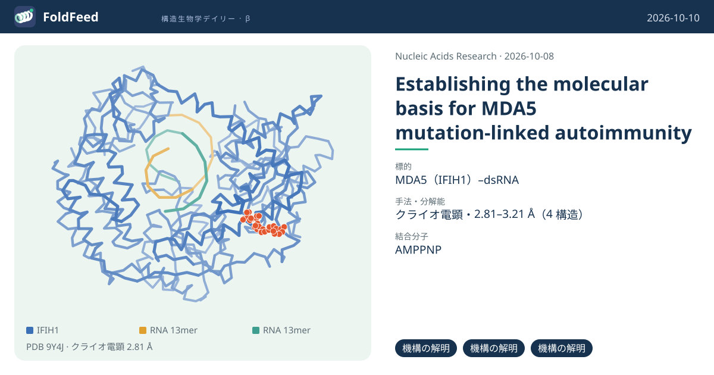
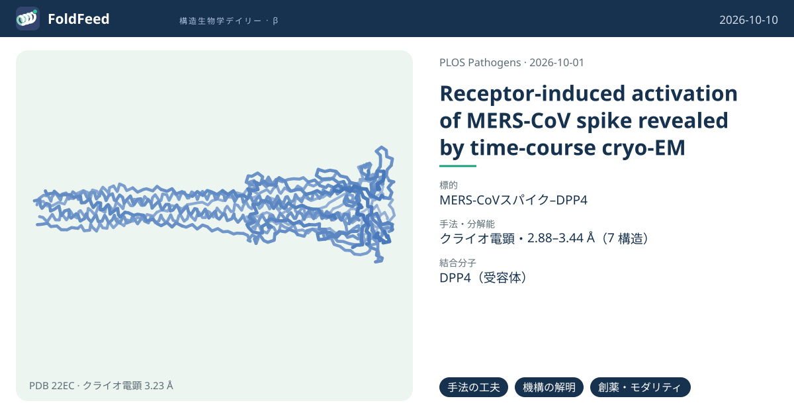
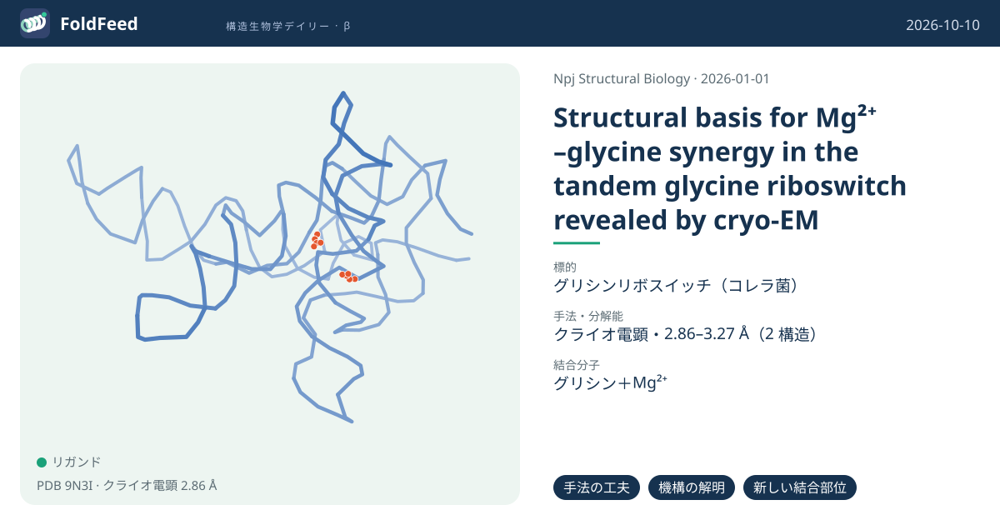
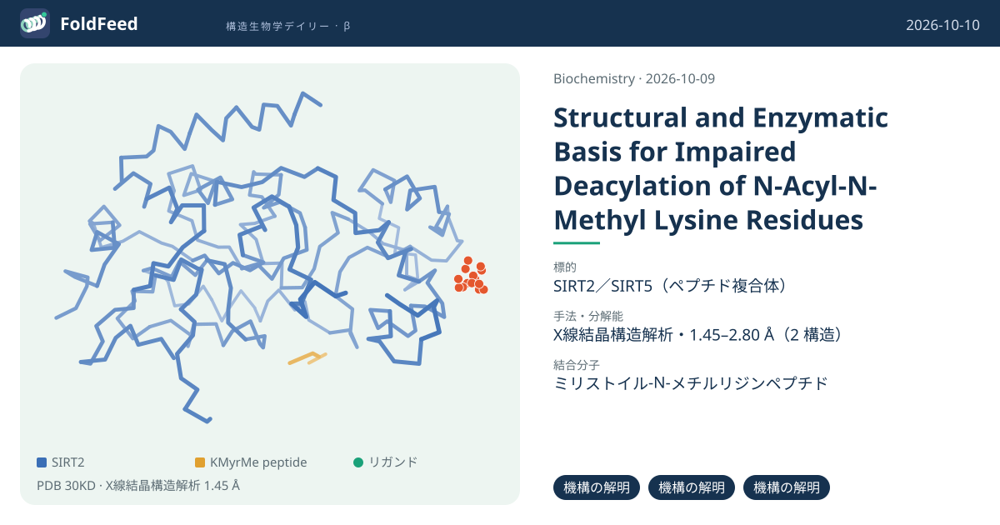
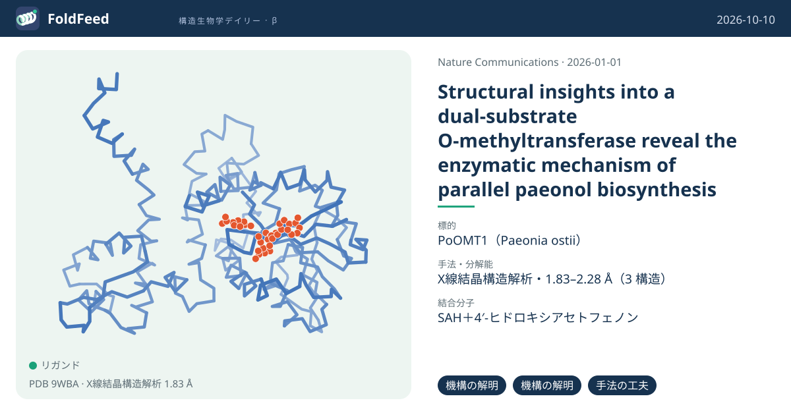
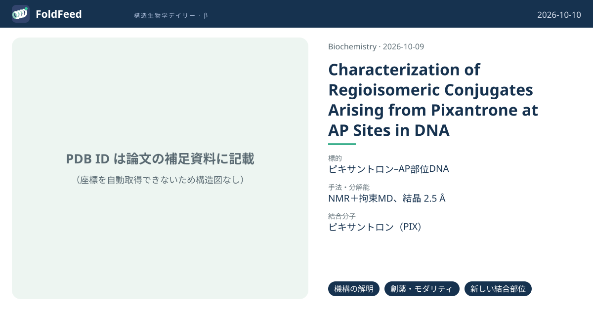

# 2026-10-10 号

**今日の新しい構造：6 本**　Europe PMC に 2026-10-09 に登録されたオープンアクセス論文 61 本のうち、新しい構造を報告した論文は 6 本。すべて紹介する。

| # | 標的 | 手法・分解能 | 見出し |
|---|---|---|---|
| 1 | MDA5（IFIH1）–dsRNA | クライオ電顕・2.81–3.21 Å（4 構造） | MDA5 T331Iは短いdsRNA上で安定なフィラメントを作る：ATP結合ポケットの乱れをクライオ電顕で可視化 `機構の解明` `機構の解明` `機構の解明` |
| 2 | MERS-CoVスパイク–DPP4 | クライオ電顕・2.88–3.44 Å（7 構造） | MERS-CoVスパイクを受容体DPP4と1〜120時間インキュベートし、活性化の経路を連続スナップショットで捉えた `手法の工夫` `機構の解明` `創薬・モダリティ` |
| 3 | グリシンリボスイッチ（コレラ菌） | クライオ電顕・2.86–3.27 Å（2 構造） | グリシンリボスイッチ：Mg²⁺とグリシンが協調して全体の折り畳みを安定化する（RNAのみで2.9 Å） `手法の工夫` `機構の解明` `新しい結合部位` |
| 4 | SIRT2／SIRT5（ペプチド複合体） | X線結晶構造解析・1.45–2.80 Å（2 構造） | N-アシル-N-メチルリジンは脱アシル化酵素に外されない：SIRT2・SIRT5の結晶構造 `機構の解明` `機構の解明` `機構の解明` |
| 5 | PoOMT1（Paeonia ostii） | X線結晶構造解析・1.83–2.28 Å（3 構造） | ボタンの根の4′-O-メチル基転移酵素PoOMT1：T字型ポケットが2基質を受け入れる `機構の解明` `機構の解明` `手法の工夫` |
| 6 | ピキサントロン–AP部位DNA | NMR＋拘束MD、結晶 2.5 Å | ピキサントロンはDNAの脱塩基部位と位置異性体を作る：NMR構造で2種ともインターカレート `機構の解明` `創薬・モダリティ` `新しい結合部位` |

> この号は AI が論文本文から作成した**レビュー用の下書き**です。数値・ID・リガンドは PDB / UniProt から取得し、AI の記述には本文からの引用を付けています。

---

## 1｜MDA5（IFIH1）–dsRNA

### MDA5 T331Iは短いdsRNA上で安定なフィラメントを作る：ATP結合ポケットの乱れをクライオ電顕で可視化

*Nucleic Acids Research*（2026-10-08） · [論文](https://doi.org/10.1093/nar/gkag941) · ライセンス: cc by  
原題：Establishing the molecular basis for MDA5 mutation-linked autoimmunity

#### 3行要約

- **背景**：自己免疫疾患に関連するMDA5変異T331Iが、なぜ恒常的なインターフェロン応答を起こすのか分子機構が不明だった。
- **やったこと**：野生型（AMPPNP）とT331I（ATP）が112 bp dsRNA上に作る短いフィラメントのクライオ電顕構造（2.81〜3.21 Å）、ATPase測定、レポーター解析を行った。
- **分かったこと**：T331IはATPase活性を失い、ATPの配置が乱れ、短いdsRNAでも安定なフィラメントを形成して30 bpのRNAでもシグナルを出す。

#### ここが面白い

**［機構の解明］** T331IはポリI:Cの存在下でもATPase活性が検出されなかった。野生型のフィラメントはATPを加えると速やかに解離するが、T331Iの短いフィラメントはATP存在下でも安定だった。

根拠（論文本文）

> However, the T331I mutant displayed no detectable ATPase activity in the presence of poly (I:C)  
> — Results

> In contrast, the short filaments formed by T331I on dsRNA112 were stable even in the presence of ATP, and no evidence of filament disassembly was observed  
> — Results

**［機構の解明］** 野生型ではArg309とArg337がATPのアデニン塩基を挟むが、T331IではATPが外側にずれてこのスタッキングが崩れ、P-ループとγリン酸の極性接触も失われる。DECHモチーフと水分子の連携も外れ、加水分解の障害と整合する。

根拠（論文本文）

> in the T331I mutant this stacking geometry is disrupted due to an outward shift of the ATP, resulting in altered positioning of Arg337  
> — Results

> the single water molecule identified in the mutant structure is no longer associated with Asp443 and Glu444 of the DECH motif  
> — Results

**［機構の解明］** T331Iのフィラメントはサブユニット間のねじれ角がほぼ一定（約71.5°）で、野生型は79.8〜82.3°とばらつく。サブユニット間の界面も野生型より424 Ų大きく、フィラメントが硬く安定化していると解釈される。

根拠（論文本文）

> the monomer–monomer interface area between the two subunits is 1264 Ų in the DiT331I/dsRNA complex, which is 424 Ų larger than that of the DiMDA5/dsRNA complex  
> — Results

#### 構造データ

| PDB | 手法 | 分解能 | 公開 | 生物種 | リガンド |
|---|---|---|---|---|---|
| [9Y4J](https://www.rcsb.org/structure/9Y4J) | クライオ電顕 | 2.81 Å | 2026-09-09 | Homo sapiens, in vitro transcription vector pT7-Fluc(deltai) | ANP |
| [9Y4L](https://www.rcsb.org/structure/9Y4L) | クライオ電顕 | 2.96 Å | 2026-09-09 | Homo sapiens, in vitro transcription vector pT7-Fluc(deltai) | ANP |
| [9Q60](https://www.rcsb.org/structure/9Q60) | クライオ電顕 | 3.12 Å | 2026-09-16 | Homo sapiens, synthetic construct | ATP |
| [9Q5W](https://www.rcsb.org/structure/9Q5W) | クライオ電顕 | 3.21 Å | 2026-09-16 | Homo sapiens, synthetic construct | ATP |

- [Q9BYX4](https://www.uniprot.org/uniprotkb/Q9BYX4) IFIH1 Interferon-induced helicase C domain-containing protein 1 — *Homo sapiens* （既存の PDB 構造 9 件）

#### 実験メモ

- **発現系**：CARD欠失MDA5とT331Iを大腸菌Rosetta (DE3)で0.2 mM IPTG、16 °C・16時間誘導。
- **コンストラクト**：N末端297残基（CARD）を除いたヒトMDA5をpET-SUMOにクローン。
- **精製**：Ni、SUMOプロテアーゼ、ヘパリンHP、Superdex 200 (16/600)。
- **結晶化／グリッド作製**：5 µMタンパク質と0.2 µMの112 bp dsRNAを2 mM AMPPNPまたはATP存在下、4 °Cで一晩インキュベート。QuantiFoil UltraAu R2/2に4 µL、Vitrobotで凍結。
- **データ収集・解析**：Titan Krios（K3）で野生型5,640枚、T331I 5,990枚、cryoSPARC v4.0。

根拠（論文本文）

> while both MDA5 (∆CARDs) and the MDA5 T331I mutant were grown at 16°C for 16 h after isopropyl β-D-1-thiogalactopyranoside (IPTG) induction  
> — Materials and methods

> The N-terminal 297 residues were removed from both protein constructs to reconstitute wild-type MDA5/dsRNA112 or T331I/dsRNA112 complexes.  
> — Materials and methods

> The protein was further purified by ion exchange with HiTrap Heparin HP column (GE Healthcare) and by size exclusion with HiLoad Superdex 200 (16/600) columns (GE Healthcare).  
> — Materials and methods

> The protein–dsRNA complexes were first assembled by the incubation of 5 µM proteins and 0.2 µM dsRNAs at 4°C overnight  
> — Materials and methods

> For MDA5/dsRNA112/AMPPNP complex, 5640 micrographs were collected.  
> — Materials and methods

> 📝 編集者への確認事項：T331I側の構造はATP結合で、野生型はAMPPNP結合。条件が異なる点は比較の注意点（著者はATP/AMPPNPで同様のねじれ角を報告）。9Q60・9Q5W のリガンドは ATP と登録されている。Tetra複合体のマップは EMDB のみで PDB の座標は Di・Mono。

---

## 2｜MERS-CoVスパイク–DPP4

### MERS-CoVスパイクを受容体DPP4と1〜120時間インキュベートし、活性化の経路を連続スナップショットで捉えた

*PLOS Pathogens*（2026-10-01） · [論文](https://doi.org/10.1371/journal.ppat.1014545.r004) · ライセンス: cc by  
原題：Receptor-induced activation of MERS-CoV spike revealed by time-course cryo-EM

#### 3行要約

- **背景**：MERS-CoVの受容体DPP4への結合が、どう膜融合につながるのかは、SARS-CoV-2に比べて理解が遅れていた。
- **やったこと**：野生型スパイク外部ドメインと可溶性DPP4を25 °Cで1、24、72、120時間混合し、各時点をクライオ電顕で解析した。
- **分かったこと**：RBDが開くほどS1–S2界面が弱まり、3-up状態は不安定でS1が解離する。72時間以降の融合後S2を3.23 Åで解いた。

#### ここが面白い

**［手法の工夫］** 反応時間を変えた試料を並べるだけで、受容体結合後の状態の分布が時間とともに移る様子を捉えた。24時間では1-up約25%・2-up約40%・3-up約28%、72時間では3-upは検出されず融合後型が約24%になった。

根拠（論文本文）

> To examine spike conformations at different incubation times, cryo-EM data were collected after 1 h, 24 h, 72 h, and 120 h of incubation.  
> — Results

> The 3-up state was no longer detected.  
> — Results

**［機構の解明］** 3-down状態に比べ3-up状態ではS1とS2の埋もれ表面積が6518.3 Ųから5293.8 Ųに減る。S2コアのHR1-CH領域も2つのDPP4が結合すると4.2 Å外側にずれ、SARS-CoV-2にはこの動きがほとんどない。

根拠（論文本文）

> By contrast, the 3-up state exhibits a smaller buried interface (5293.8 Ų) (Fig 2B)  
> — Results

> the HR1-CH region was displaced by 4.2 Å relative to the 3-down conformation  
> — Results

**［創薬・モダリティ］** 融合後S2（3.23 Å）では、HR2の上流リンカーがSD3とのβシートを離れ、隣のプロトマーの溝に沿う伸びた構造に再編される。著者は広域の融合阻害剤や中和抗体の標的候補とするが、これは構造からの推測である。

根拠（論文本文）

> In the pre-fusion state, a β-strand from this linker forms a β-sheet with the SD3 domain, stabilizing it in a folded conformation adjacent to SD3.  
> — Results

> These observations suggest that stabilizing the prefusion conformation of the HR2 upstream linker, or preventing its rearrangement, may interfere with membrane fusion  
> — Results

#### 構造データ

| PDB | 手法 | 分解能 | 公開 | 生物種 | リガンド |
|---|---|---|---|---|---|
| [22FY](https://www.rcsb.org/structure/22FY) | クライオ電顕 | 3.24 Å | 2026-09-02 | Middle East respiratory syndrome-related coronavirus | — |
| [22DX](https://www.rcsb.org/structure/22DX) | クライオ電顕 | 3.29 Å | 2026-09-02 | Homo sapiens, Middle East respiratory syndrome-related coronavirus (isolate United Kingdom/H123990006/2012) | — |
| [22DY](https://www.rcsb.org/structure/22DY) | クライオ電顕 | 3.35 Å | 2026-09-02 | Homo sapiens, Middle East respiratory syndrome-related coronavirus (isolate United Kingdom/H123990006/2012) | — |
| [22DZ](https://www.rcsb.org/structure/22DZ) | クライオ電顕 | 3.01 Å | 2026-09-02 | Middle East respiratory syndrome-related coronavirus (isolate United Kingdom/H123990006/2012) | — |
| [22EA](https://www.rcsb.org/structure/22EA) | クライオ電顕 | 3.44 Å | 2026-09-02 | Homo sapiens, Middle East respiratory syndrome-related coronavirus (isolate United Kingdom/H123990006/2012) | — |
| [22EB](https://www.rcsb.org/structure/22EB) | クライオ電顕 | 2.88 Å | 2026-09-02 | Homo sapiens, Middle East respiratory syndrome-related coronavirus | — |
| [22EC](https://www.rcsb.org/structure/22EC) | クライオ電顕 | 3.23 Å | 2026-09-02 | Betacoronavirus England 1 | — |

- [K9N5Q8](https://www.uniprot.org/uniprotkb/K9N5Q8) S Spike glycoprotein — *Middle East respiratory syndrome-related coronavirus (isolate United Kingdom/H123990006/2012)* （既存の PDB 構造 64 件）
- [P27487](https://www.uniprot.org/uniprotkb/P27487) DPP4 Dipeptidyl peptidase 4 — *Homo sapiens* （既存の PDB 構造 116 件）

#### 実験メモ

- **発現系**：HEK293Fにポリエチレンイミンで一過性発現、72時間後に上清を回収。
- **コンストラクト**：MERS-CoVスパイク外部ドメイン（残基1–1,291）、N末gp67シグナル、C末T4フィブリチンと6×His。
- **精製**：Ni-Sepharose、Superose 6 Increase 10/300（20 mM Tris、200 mM NaCl、pH 8.0）。
- **結晶化／グリッド作製**：スパイク0.7 mg/mLとDPP4 1.5 mg/mLをモル比1:1.1で25 °C、所定時間インキュベート。グリッドに3 µL、Vitrobot IV。
- **データ収集・解析**：Titan Krios G4（Falcon 4i、Selectris）、RelionとcryoSPARC v4.4.1。

根拠（論文本文）

> The plasmid was transfected into HEK293F cells by polyethylenimine, supernatant was harvested after 72h  
> — Methods

> The gene encoding the ectodomain of the MERS-CoV spike (UniProt: K9N5Q8, residues 1–1,291) was synthesized  
> — Methods

> The target protein was further purified by Superose 6 Increase 10/300 column (GE Healthcare) in 20 mM Tris, 200 mM NaCl, pH 8.0 buffer  
> — Methods

> MERS-CoV spike was diluted to 0.7 mg/mL and mixed with 1.5 mg/mL DPP4 at a molar ratio of 1:1.1 (S trimer/DPP4), and incubated for 24 h at 25°C.  
> — Methods

> Cryo-EM data for MERS S-DPP4 were automatically collected using EPU software on a Titan Krios G4 microscope at 300 kV.  
> — Methods

> 📝 編集者への確認事項：著者は、構造は離散的なスナップショットで、反応が実際の侵入より遥かに遅い（可溶性タンパク質、25 °C、膜・プロテアーゼなし）in vitro の条件下のものと明記している。SARS-CoV-2より活性化が遅いという比較は他論文の条件との定性的比較。DPP4ダイマーによるトリマー間架橋は推測。ga_pdb_id=22EC は融合後S2で、DPP4を含まない。DPP4との複合体を示すには 22EA（3-up）も候補。

---

## 3｜グリシンリボスイッチ（コレラ菌）

### グリシンリボスイッチ：Mg²⁺とグリシンが協調して全体の折り畳みを安定化する（RNAのみで2.9 Å）

*Npj Structural Biology*（2026-01-01） · [論文](https://doi.org/10.1038/s44511-026-00002-y) · ライセンス: cc by  
原題：Structural basis for Mg²⁺–glycine synergy in the tandem glycine riboswitch revealed by cryo-EM

#### 3行要約

- **背景**：リボスイッチは構造の不均一性が機能に不可欠だが、RNAは不均一性のため高分解能の構造解析が難しい。
- **やったこと**：コレラ菌タンデムアプタマーをリガンドなし、Mg²⁺のみ、Mg²⁺＋グリシンの3条件でクライオ電顕にかけ、MDで補強した。
- **分かったこと**：全体が折り畳まれた「walking man」型の集団は、Mg²⁺のみで約1/3、グリシン追加で約2/3になる。両リガンドは協調的に結合する。

#### ここが面白い

**［手法の工夫］** 粒子をサイズで絞らずに拾い、3条件それぞれで10個の構造にヘテロジニアス精製して、折り畳み状態の集団比を比較した。リガンドの添加で集団が移る様子を直接見られる。

根拠（論文本文）

> By picking particles without stringent size restrictions, we were able to generate a comparative ensemble of maps for each condition.  
> — Introduction

> When glycine and magnesium are both present, approximately two thirds of all particles are fully folded  
> — Results

**［機構の解明］** グリシン結合部位の2つのMg²⁺は、グリシン非存在下で密度が消えるか大きく弱まる。2つのアプタマーはHoogsteen塩基対（U77–A206）を介して安定化の経路でつながって見える。

根拠（論文本文）

> It is notable that the magnesium density within the glycine binding pocket is either absent (as in Apt-II) or significantly diminished (as in Apt-I) in the absence of glycine (Fig. 5C), even though the magnesium concentration is held constant.  
> — Results

**［新しい結合部位］** 2.9 Å密度ではグリシンの向きを一意に決められず、MDとメタダイナミクスで検討した。アミノ基がA68・A175のリン酸側を向く配置が支持され、従来の結晶構造と異なる向きだった。

根拠（論文本文）

> Although the 2.9 Å structure generated here is of insufficient resolution to confidently orient a small glycine ligand, our data are more consistent with an alternate arrangement where the nitrogen group points towards the adjacent phosphate from residue A175  
> — Results

#### 構造データ

| PDB | 手法 | 分解能 | 公開 | 生物種 | リガンド |
|---|---|---|---|---|---|
| [9N3I](https://www.rcsb.org/structure/9N3I) | クライオ電顕 | 2.86 Å | 2026-07-29 | Vibrio cholerae | GLY |
| [9N3J](https://www.rcsb.org/structure/9N3J) | クライオ電顕 | 3.27 Å | 2026-08-05 | Vibrio cholerae | — |

#### 実験メモ

- **発現系**：in vitroでT7 RNAポリメラーゼ転写（AmpliScribe T7）、RNAClean XPビーズで精製。
- **コンストラクト**：コレラ菌のタンデムアプタマー（発現プラットフォームなし）。Kappel et al. (2020) の構築に基づく。
- **精製**：5回分の調製を合わせ、2.5 mg/mlに濃縮。
- **結晶化／グリッド作製**：1.2 mg/mlのRNAを95 °Cで変性後に氷冷し、MgCl₂（とグリシン）を加えて37 °C・30分。Quantifoil R1.2/1.3 金グリッド、Vitrobot Mark IV。
- **データ収集・解析**：Titan Krios G3i（K3）、0.823 Å/px、cryoSPARC v4.6.0。

根拠（論文本文）

> The RNA was prepared through in vitro T7 RNA polymerase transcription using an AmpliScribe T7 High Yield Transcription Kit  
> — Methods

> Five separate preparations of RNA were combined and concentrated using a vacuum concentrator to generate the final 2.5 mg/ml sample.  
> — Methods

> Either MgCl2 or MgCl2 and glycine were added to respective samples, and all three RNA solutions were then incubated at 37 oC for 30 min.  
> — Methods

> Data were collected with a pixel size of 0.823 Å on a Titan Krios G3i (Thermo Fisher Scientific) operated at 300 kV using a Gatan K3 BioQuantum direct electron detector.  
> — Methods

> 📝 編集者への確認事項：グリシンの向きは密度だけでは決まらず MD による支持。著者は in vitro で細胞内の混雑や転写共役の折り畳みを再現していないと述べている。9N3J は Mg²⁺のみ（3.3 Å、グリシンなし）。集団比は粒子分類に依存し、約41%は同定できないクラス。

---

## 4｜SIRT2／SIRT5（ペプチド複合体）

### N-アシル-N-メチルリジンは脱アシル化酵素に外されない：SIRT2・SIRT5の結晶構造

*Biochemistry*（2026-10-09） · [論文](https://doi.org/10.1021/acs.biochem.6c00508) · ライセンス: cc by  
原題：Structural and Enzymatic Basis for Impaired Deacylation of N‑Acyl‑N‑Methyl Lysine Residues

#### 3行要約

- **背景**：ヒストンH4で見つかったN-アセチル-N-メチルリジン（KAcMe）が、HDACやサーチュインで除去できるかは不明だった。
- **やったこと**：KAcMeなどのモデルペプチドを合成し、HDAC1–11とSIRT1–6で脱アシル化を調べ、SIRT2・SIRT5とペプチドの結晶構造を決めた。
- **分かったこと**：KAcMeはどの酵素にも検出可能な脱アセチル化を受けなかった。N-メチル化は基質の位置を乱し、切断されるアミド結合が触媒に不適な向きになる。

#### ここが面白い

**［機構の解明］** N-メチル基が加わると、試したサーチュインはH4K5のアセチル基もスクシニル基も外せなかった。N-メチル化はアミド結合の切断そのものを妨げる。

根拠（論文本文）

> Using peptides 4 and 8 methylated additionally to the respective acylation showed that neither deacetylation of H4K5AcMe (4) nor desuccinylation of H4K5SucMe (8) could be achieved by any tested sirtuin  
> — Results

**［機構の解明］** zSIRT5–KSucMe複合体（2.8 Å）では、リジンNεとV221の相互作用が失われ、三級アミドのカルボニル酸素がNAD+の結合ポケットから約145°背を向ける。NAD+のリボースC1′を攻撃できる向きではない。

根拠（論文本文）

> The carbonyl oxygen of the tertiary amide bond of KSucMe is turned by about 145° away from the NAD+ binding pocket  
> — Results

**［機構の解明］** SIRT2–ミリストイル-N-メチルリジンペプチド複合体（1.45 Å）ではアミド結合がcis型をとる。NAD+を浸漬した構造（2.80 Å）ではtrans型に変わり、Zn結合ドメインの閉じに伴う立体障害が原因と著者は考える。SIRT2は600倍遅いながら反応できる。

根拠（論文本文）

> Notably, the myristoyl amide bond of KMyrMe switches from cis to trans in the NAD+-bound structure.  
> — Results

> The additional methylation of the myristoyl-lysine caused about a 600-fold reduction of the demyristoylation rate of SIRT2  
> — Results

#### 構造データ

| PDB | 手法 | 分解能 | 公開 | 生物種 | リガンド |
|---|---|---|---|---|---|
| [30KD](https://www.rcsb.org/structure/30KD) | X線結晶構造解析 | 1.45 Å | 2026-09-30 | Homo sapiens, synthetic construct | BTB |
| [30KE](https://www.rcsb.org/structure/30KE) | X線結晶構造解析 | 2.80 Å | 2026-09-30 | Homo sapiens, synthetic construct | NAD |
| 30KU | — | — | 公開待ち | — | — |

- [Q8IXJ6](https://www.uniprot.org/uniprotkb/Q8IXJ6) SIRT2 NAD-dependent protein deacetylase sirtuin-2 — *Homo sapiens* （既存の PDB 構造 79 件）

#### 実験メモ

- **発現系**：SIRT2はHis10タグ付きで発現を1 mM IPTGで誘導し、20 °Cで16時間培養。
- **コンストラクト**：ヒトSIRT2の56–356残基。
- **精製**：TEVでタグを除去し、HisTrapの素通り画分をSuperdex S75でゲル濾過。
- **結晶化／グリッド作製**：SIRT2–ペプチド結晶にNAD+を6時間浸漬してNAD+複合体を得た。
- **データ収集・解析**：ESRFのID30A-3（MASSIF-3）とID23-2で測定、autoPROCとAimlessで処理。

根拠（論文本文）

> Protein expression of His10-tagged SIRT2 was induced with 1 mM IPTG, followed by incubation for 16 h at 20 °C.  
> — Methods

> The His10-Tag was cleaved via TEV protease in lysis buffer  
> — Methods

> Crystals were incubated in this solution for 6 h, then cryoprotected with the reservoir solution supplemented with 10% (v/v) DMSO  
> — Methods

> The data sets were processed with autoPROC and scaled using Aimless.  
> — Methods

> 📝 編集者への確認事項：30KU（zSIRT5–KSucMe）は未公開のため図には使えない。HDACについての結論は活性測定とAlphaFold2モデルへのドッキングによる推定で、HDACの結晶構造はない。本文の誤植らしき表記（Suc/Acの取り違え）は触れていない。ligand_label は仮。

---

## 5｜PoOMT1（Paeonia ostii）

### ボタンの根の4′-O-メチル基転移酵素PoOMT1：T字型ポケットが2基質を受け入れる

*Nature Communications*（2026-01-01） · [論文](https://doi.org/10.1038/s41467-026-77639-1) · ライセンス: cc by-nc-nd  
原題：Structural insights into a dual-substrate O-methyltransferase reveal the enzymatic mechanism of parallel paeonol biosynthesis

#### 3行要約

- **背景**：牡丹皮の指標成分ペオノールの生合成後半（4′-O-メチル化と2′-水酸化）を担う酵素は未同定で、構造も機構も不明だった。
- **やったこと**：トランスクリプトームとメタボロームからPoOMT1を同定し、SAH複合体と基質2種との三者複合体の結晶構造（1.83〜2.28 Å）、変異体解析で調べた。
- **分かったこと**：His262-Asn263-Gln324の触媒三残基と、二重アンカーおよび立体制約を持つT字型ポケットが4′-OHへの位置選択性と2基質の受容を説明する。

#### ここが面白い

**［機構の解明］** 植物のI型OMTに保存されたHis-Asp-Glu三残基のAspとGluが、PoOMT1ではAsn263とGln324に置換されている。H262A・N263Aは活性を消失し、Q324Eは活性を2倍以上に高めた。

根拠（論文本文）

> Mutations H262A, N263A, and N263D completely abolished catalytic activity toward substrate 2.  
> — Results and discussion

> whereas the Q324E mutation enhanced activity over 2-fold  
> — Results and discussion

**［機構の解明］** 基質のアセチル基はLeu120・Leu126・Asn121に、4′-OHはHis262・Asn263に固定される（二重アンカー）。2′-OHはポケットと相互作用せず、2基質の触媒効率が近い理由になる。

根拠（論文本文）

> PoOMT1 thus employs a dual-anchor mechanism that stabilizes both the acetyl group and the 4’-hydroxyl group of the substrates.  
> — Results and discussion

> consistent with similar catalytic efficiencies toward substrates 1 and 2  
> — Results and discussion

**［手法の工夫］** Region D（L117・F312・L315）をTrpに置換すると、2′-OHを持つ基質2への活性だけが消え、基質1への活性は保たれた。ポケットの形から基質選択を設計できることを示す。

根拠（論文本文）

> Mutating L117, F312, and L315 in region D to bulkier tryptophan abolished activity toward substrate 2 but largely preserved activity toward substrate 1  
> — Results and discussion

#### 構造データ

| PDB | 手法 | 分解能 | 公開 | 生物種 | リガンド |
|---|---|---|---|---|---|
| [9WAZ](https://www.rcsb.org/structure/9WAZ) | X線結晶構造解析 | 2.03 Å | 2026-06-24 | Paeonia ostii | SAH |
| [9WBA](https://www.rcsb.org/structure/9WBA) | X線結晶構造解析 | 1.83 Å | 2026-08-26 | Paeonia ostii | SAH, AC6 |
| [9WB6](https://www.rcsb.org/structure/9WB6) | X線結晶構造解析 | 2.28 Å | 2026-06-24 | Paeonia ostii | SAH, A1EVU |

#### 実験メモ

- **発現系**：大腸菌Rosetta (DE3)で0.4 mM IPTG、18 °C・18時間。
- **コンストラクト**：pET28a(+)-SUMO-OMT。Ulp1でSUMOタグを除去。
- **精製**：Ni-NTA、Ulp1処理後に再度Ni-NTA、Superdex 75。10.0 mg/mLに濃縮。
- **結晶化／グリッド作製**：タンパク質10.0 mg/mLに5 mM SAH（と5 mM基質）を氷上30分混合し、シッティングドロップ蒸気拡散、18 °C。
- **データ収集・解析**：SSRFのBL18U1、XDSで処理、AlphaFold2モデルで分子置換。

根拠（論文本文）

> Protein expression was induced with 0.4 mM isopropyl β-D-1-thiogalactopyranoside, followed by incubation at 18 °C for 18 h.  
> — Methods

> Eluted proteins were digested with Ubl-specific protease 1(Ulp1) at 4 °C for 8 h to remove SUMO tag.  
> — Methods

> purified PoOMT1 protein (10.0 mg/mL) was incubated with 5 mM SAH or 5 mM SAH and 5 mM of either substrate 1 or 2 on ice for 30 min prior to crystallization.  
> — Methods

> The predicted structure of PoOMT1 by Alphafold254 was used as the searching model.  
> — Methods

> 📝 編集者への確認事項：UniProt 未対応のため標的情報は PDB のみ。ga_pdb_id=9WBA は基質1との三者複合体（9WB6 は基質2）。論文は「構造が未知」と述べるが「初構造」とは明言していないので初構造扱いにしていない。本文に基質番号の欠落（Metabolomics 節）がある。 溶液中は二量体（ゲル濾過で約70 kDa）だが結晶中は単量体という点は記事から省いた。

---

## 6｜ピキサントロン–AP部位DNA

### ピキサントロンはDNAの脱塩基部位と位置異性体を作る：NMR構造で2種ともインターカレート

*Biochemistry*（2026-10-09） · [論文](https://doi.org/10.1021/acs.biochem.6c00116) · ライセンス: cc by  
原題：Characterization of Regioisomeric Conjugates Arising from Pixantrone at AP Sites in DNA

#### 3行要約

- **背景**：抗がん剤ピキサントロン（PIX）は非対称な構造のため、DNAの脱塩基（AP）部位と2種の位置異性体を作ると予想されたが、特徴づけがなかった。
- **やったこと**：還元型PIX–AP部位コンジュゲートを含む12量体二本鎖をNMRで解析し、NOE拘束付きMDで構造を求めた。ドデカマーの結晶構造（2.5 Å）も解いた。
- **分かったこと**：二本鎖DNAではR a:R b＝6:4で、どちらも3′側にインターカレートし対向するシトシンをメジャー溝へ押し出す。R bの方が深く入る。

#### ここが面白い

**［機構の解明］** 一本鎖ではR aとR bが1:1で生成するが、二本鎖では0 °Cで約1.8:1とR aが優勢で、Tm以上の60 °Cでは約1.1:1に戻る。著者は対向するシトシンとの水素結合が関与する速度論的な説明を「確定した機構ではなく妥当な解釈」とする。

根拠（論文本文）

> Significantly, in ssDNA containing an AP site, where the complementary cytosine C18 is absent, both regioisomers R a and R b form in equal proportions.  
> — Discussion

> This represents one possible interpretation based on NMR-derived structural evidence and should be viewed as a plausible explanation rather than a definitive mechanistic conclusion.  
> — Discussion

**［創薬・モダリティ］** 還元型PIX–AP部位コンジュゲートは、AP部位を模すTHF入り二本鎖（Tm 37.2 °C）より10.4 °C安定化したが、無修飾二本鎖（58.8 °C）よりは11.2 °C低い。AP部位を完全には修復できない。

根拠（論文本文）

> The T m of the unmodified duplex 5′-d  
> — Results

> This resulted in a 10.4 °C increase in the T m  
> — Results

**［新しい結合部位］** 結晶構造ではPIXはインターカレートせず、隣の二本鎖のPIXと積み重なって外側に反転していた。NMR溶液構造の挿入型と異なる。

根拠（論文本文）

> the pixantrone (PIX) moieties do not intercalate into the DNA as traditionally expected; instead, they are flipped relative to one another in an extrahelical orientation  
> — Results

#### 構造データ

寄託の記載はあるが、ID は補足資料にのみ記載されている。

#### 実験メモ

- **コンストラクト**：ウラシル入りの12量体をUDGで処理してAP部位化し、ピキサントロンとNaBH3CNで還元型コンジュゲートを作製。
- **精製**：逆相HPLC（C18）後、相補鎖とアニールしてヒドロキシアパタイトで精製し、Sephadex G-25で脱塩。
- **結晶化／グリッド作製**：NMRは300 µM二本鎖、100 mM NaCl、10 mM NaH2PO4（pH 7.0）。結晶は1 mM DNAでハンギングドロップ蒸気拡散。
- **データ収集・解析**：NMRは900 MHz、NOESY 250 ms、288 K。X線はAPSのLS-CAT 21-ID-Dで測定し、Br-SADで位相決定。

根拠（論文本文）

> Escherichia coli uracil-DNA glycosylase (UDG; EC 3.2.2.3; New England Biolabs; Ipswich, MA) (0.25 units/μL) was added to the uracil-containing dodecamer  
> — Materials and Methods

> The duplex dodecamer containing the reduced PIX-AP site conjugate was passed over a hydroxyapatite (HAP) column  
> — Materials and Methods

> The concentrations of dodecamer duplexes were 300 μM.  
> — Materials and Methods

> The hanging drop vapor diffusion technique was used.  
> — Materials and Methods

> The structure was phased by Br-SAD using Phenix Autosol  
> — Materials and Methods

> 📝 編集者への確認事項：PDB/UniProt の情報がなく（ID は補足資料のみ）、図は PDB 情報なしで出る。NMR構造の座標の登録は本文から確認できない。結晶構造は PDB 7U38 と本文にあるが、候補データには載っていない。単一ドデカマー配列での結果で、結晶とNMRで挿入様式が異なる。Tm の記述で『安定化』の対象（THF入り二本鎖）に注意。ランクは手法・薬物-DNA相互作用として最後に置いた。

---
